# Listas

En Python, cuando trabajamos con listas, surge la necesidad de acceder a los elementos contenidos dentro de la misma, ya que de esta manera podemos consultar e incluso modificar su contenido.

Para acceder a los elementos de una lista, es necesario apoyarnos de los índices, los cuales, le indicaran a nuestro programa la posición exacta del elemento con el cual deseamos trabajar dentro de la lista.

 Ejemplo: 

```python
marcas = ["Apple", "Samsung", "Xiaomi", "Huawei"]
```

Al ejecutar la línea anterior, Python almacena la lista en un espacio en memoria, donde cada elemento contiene una posición:

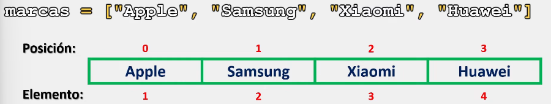

___

Para conocer la longitud de nuestra lista, nos podemos apoyar de la función [len()](Primera%20parte/La%20función%20len().md):

```python
marcas = ["Apple", "Samsung", "Xiaomi", "Huawei"]
print(len(marcas))

# Salida: 4
```

Al ejecutar la línea anterior, len() nos devuelve la longitud de nuestra lista (nuestra cantidad de elementos). Y, partiendo de aquí, podemos conocer cuantas posiciones tenemos.

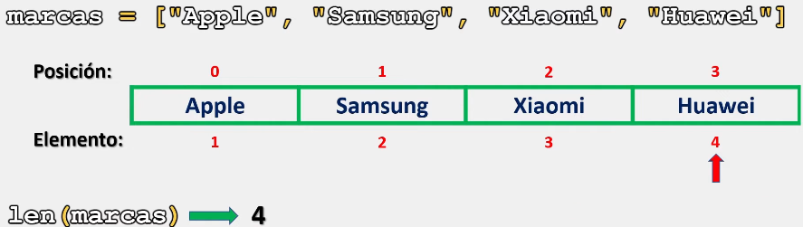

## Acceder a los elementos de una lista

### Accediendo a un solo elemento.

Cuando ejecutamos **print(lista)**, Python nos muestra todos los elementos dentro de la lista:

```python
marcas = ["Apple", "Samsung", "Xiaomi", "Huawei"]
print(marcas)

# Salida: ['Apple', 'Samsung', 'Xiaomi', 'Huawei']
```

___

Para acceder a un elemento de la lista debemos escribir el nombre de nuestra lista seguido de la posición del elemento dentro de dos corchetes:

```python
# Ejemplo 1:

marcas = ["Apple", "Samsung", "Xiaomi", "Huawei"]
print(marcas[1])

# Salida: Samsung
```

Ejemplo grafico:

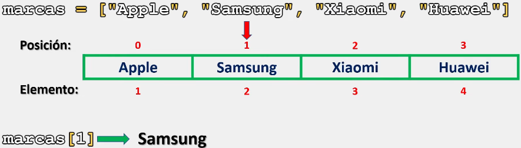

Ejemplo 2:

```python
# Ejemplo 2:

marcas = ["Apple", "Samsung", "Xiaomi", "Huawei"]
print(marcas[3])

# Salida: Huawei
```

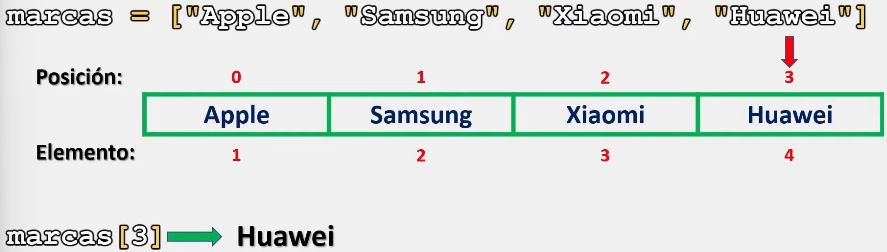

___

Otra ventaja de las listas es que podemos trabajar con índices negativos:

```python
# Ejemplo 1:

marcas = ["Apple", "Samsung", "Xiaomi", "Huawei"]
print(marcas[-1])

# Salida: Huawei
```

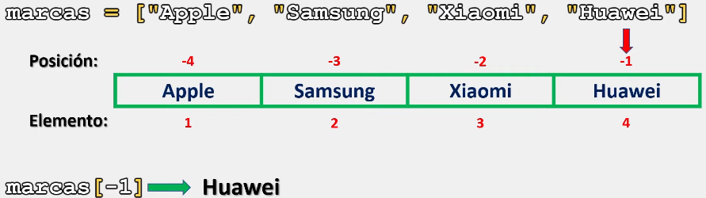

Ejemplo 2:

```python
# Ejemplo 2:

marcas = ["Apple", "Samsung", "Xiaomi", "Huawei"]
print(marcas[-3])

# Salida: Samsung
```

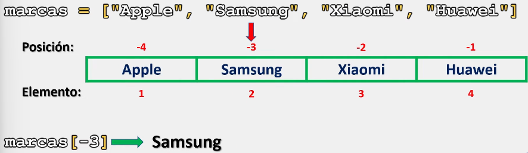

### Accediendo a dos o más elementos.

Al igual que cuando tocamos el tema de [slicing](Primera%20parte/Substrings.md), podemos crear un rango dentro de la lista para obtener más de un elemento:

```python
# Ejemplo 1:

marcas = ["Apple", "Samsung", "Xiaomi", "Huawei"]
print(marcas[1:3])

# Salida: ['Samsung', 'Xiaomi']
```

Donde, como se observa, Python genera un rango de donde obtendrá los valores:

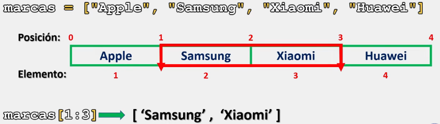

Al igual que con los substrings, podemos no especificar los índices dentro de los corchetes:

```python
# Ejemplo 2:

marcas = ["Apple", "Samsung", "Xiaomi", "Huawei"]
print(marcas[:2])

# Salida: ['Apple', 'Samsung']
```

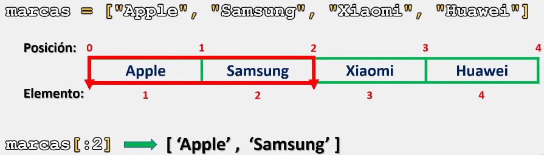

Ejemplo 3:

```python
# Ejemplo 3:

marcas = ["Apple", "Samsung", "Xiaomi", "Huawei"]
print(marcas[1:])

# Salida: ['Samsung', 'Xiaomi', 'Huawei']
```

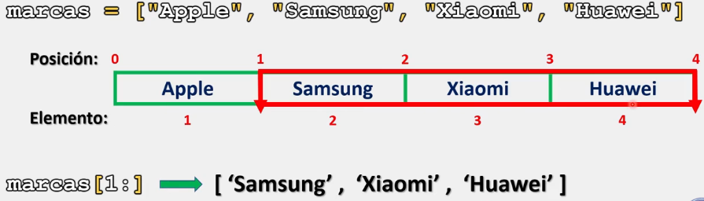

Ejemplo 4:

```python
# Ejemplo 4:

marcas = ["Apple", "Samsung", "Xiaomi", "Huawei"]
print(marcas[:])

# Salida: ['Apple', 'Samsung', 'Xiaomi', 'Huawei']
```

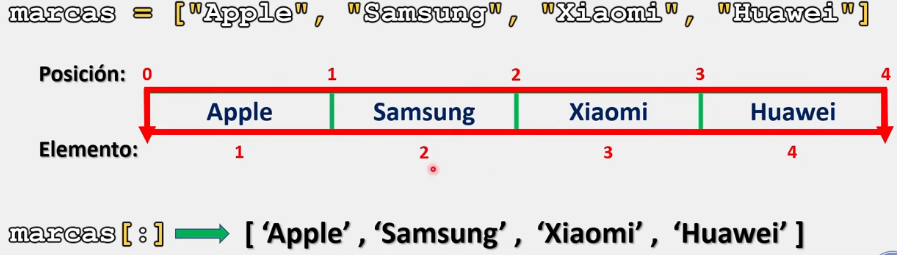

### Error de índice en la listas:

Cuando le indicamos a Python que busque elementos por su índice y estos no existen dentro de la lista, Python nos devolverá un error de índice:

```python
# Ejemplo 1:

marcas = ["Apple", "Samsung", "Xiaomi", "Huawei"]
print(marcas[4])

# Salida: IndexError: list index out of range
```

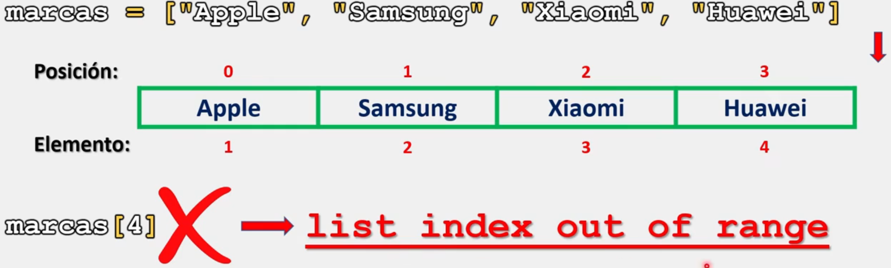

> Se recomienda practicar este tema modificando los ejercicios anteriores y empezando crear sus propios programas con todo lo visto hasta el momento.