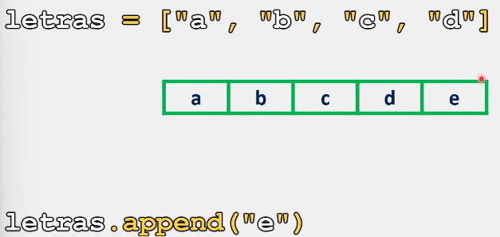

# Listas

En Python, al trabajar con listas, se llega a la necesidad de agregar nuevos elementos a las mismas, para así, ampliar la cantidad de información con la que estamos trabajando.

Para esta situación, contamos con el método **append()**, el cual nos permite agregar nuevos elementos al final de una lista.

## Sintaxis

La sintaxis para utilizar el método **append()** es la siguiente:

```python
nombre_lista.append(nuevo_elemento)
# Este metodo solo funcionara agregando un argumento entre sus parentesis que representa el elemento que se busca agregar
```

## Método append()

Para comprender el funcionamiento e implementación de este método dentro del código, veamos algunos ejemplos: 

```python
# Ejemplo 1:
letras = ["a", "b", "c", "d"]
print(f"Lista antes del cambio: {letras}")
letras.append("e")
print(f"Lista despues del método append(): {letras}")

# Salida:

# Lista antes del cambio: ['a', 'b', 'c', 'd']
# Lista después del método append(): ['a', 'b', 'c', 'd', 'e']
```

Ejemplo grafico:



Ejemplo 2:

```python
# Ejemplo 2:
letras = ["a", "b", "c", "d"]
print(f"Lista antes del cambio: {letras}")
letras.append("e")
letras.append("f")
print(f"Lista despues del método append(): {letras}")

# Salida:

# Lista antes del cambio: ['a', 'b', 'c', 'd']
# Lista despues del método append(): ['a', 'b', 'c', 'd', 'e', 'f']
```

Ejemplo 3:

```python
# Ejemplo 3:
letras = ["a", "b", "c", "d"]
print(f"Lista antes del cambio: {letras}")
letras.append("e")
letras.append("f")
letras.append("g")
print(f"Lista despues del método append(): {letras}")

# Salida:

# Lista antes del cambio: ['a', 'b', 'c', 'd']
# Lista despues del método append(): ['a', 'b', 'c', 'd', 'e', 'f', 'g']
```

Ejemplo 4:

```python
# Ejemplo 4:
letras = ["a", "b", "c", "d"]
print(f"Lista antes del cambio: {letras}")
letras.append(5)
letras.append(2.3)
letras.append(True)
print(f"Lista despues del método append(): {letras}")

# Salida:

# Lista antes del cambio: ['a', 'b', 'c', 'd']
# Lista después del método append(): ['a', 'b', 'c', 'd', 5, 2.3, True]
```

> Se recomienda practicar este tema modificando los parámetros y valores de los ejercicios anteriormente presentados para comprender su funcionamiento. 