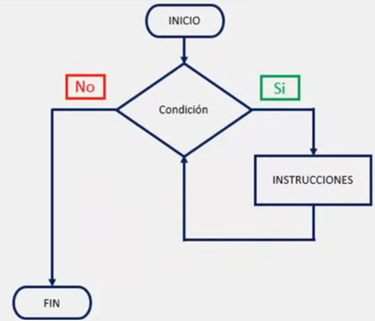

# Ciclos o Bucles

En ocasiones cuando estamos desarrollando un programa, nos encontramos con la necesidad de ejecutar una o más líneas de código en repetidas ocasiones, con lo cual la opción más lógica es duplicar el código de estas instrucciones para que el programa realice la tarea asignada. 

Sin embargo, esta alternativa no es la más optima ya que duplicar código puede generar diversos problemas como, por ejemplo, archivos innecesariamente más extensos y difíciles de comprender al momento de querer realizar alguna modificación o actualización del mismo.

Ante esta situación, en programación contamos con sentencias de repetición de código, las cuales nos permiten ejecutar una seria de instrucciones o líneas de código de manera controlada dentro de nuestros programas, a las cuales se les conoce como ciclos o bucles.

Un ciclo o bucle permite ejecutar en repetidas ocasiones las instrucciones o líneas de código indicadas por el programador, con lo cual, no existe la necesidad de duplicar líneas de código para ejecutarlas en más de una ocasión.

## Ciclo o bucle while

En Python contamos con el ciclo o bucle while, el cual permite repetir la ejecución de un grupo de instrucciones, mientras se cumpla una condición, es decir, mientras la condición del ciclo o bucle se cumpla las instrucciones se seguirán ejecutando.

Ejemplo de diagrama de flujo para el ciclo while:



### Sintaxis del bucle o ciclo while

```python
'''
while condición:
	instrucción
	instrucción
	instrucción
'''

# Ejemplo 1 de uso:

X = 1

while X < 3:
	print(x)
	X += 1

print("Fin.")

######

# Salida:

# 1
# 2
# Fin.

#-----------------------------------

# Ejemplo 2 de uso:

X = 0

while X < 10:
	print("Ejercicio")
	X += 1


######

# Salida:

# Ejercicio
# Ejercicio
# Ejercicio
# Ejercicio
# Ejercicio
# Ejercicio
# Ejercicio
# Ejercicio
# Ejercicio
# Ejercicio

#_________________________
# Como se ve con los ejemplos anteriores, el programa cumple con las instrucciones contenidas en su interior, (instrucciones con la 'tabulación'), siempre que la condición se cumpla (En este caso si X < 3) o (X < 10).

# Y, cuando la condición no se cumple más, finaliza el ciclo y continua el programa.
```

> Se recomienda replicar este ejercicio en su computadora para asimilar el aprendizaje de manera practica.

