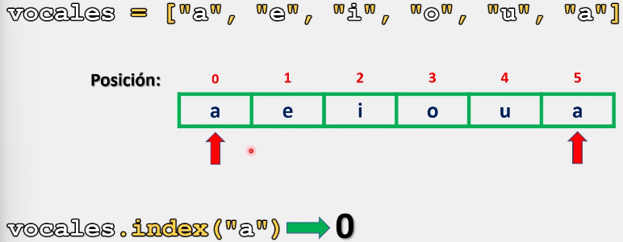
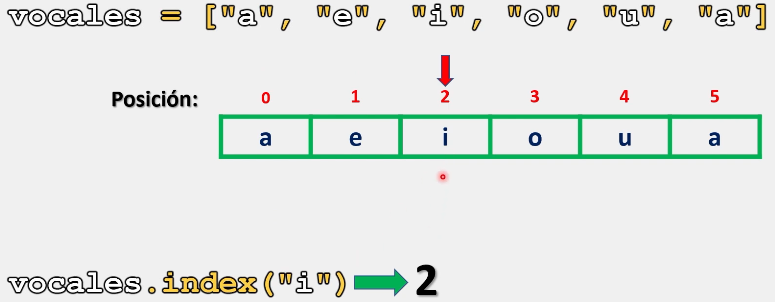
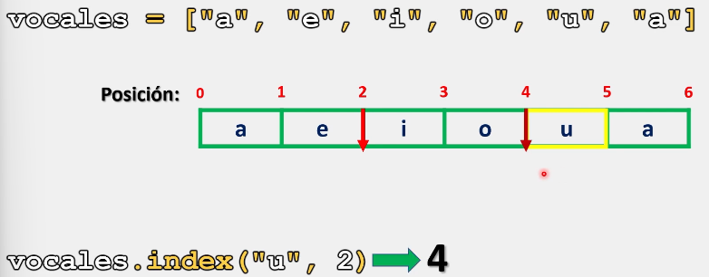
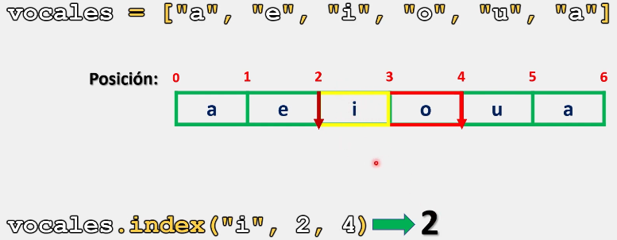
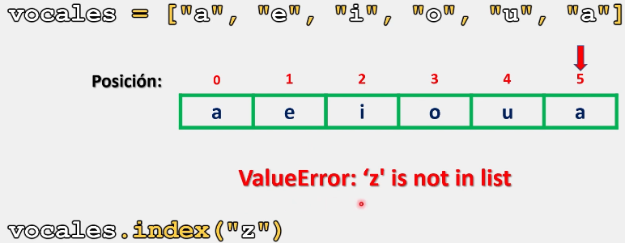
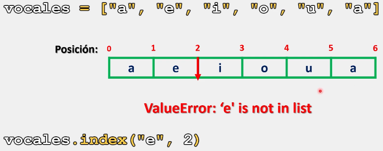
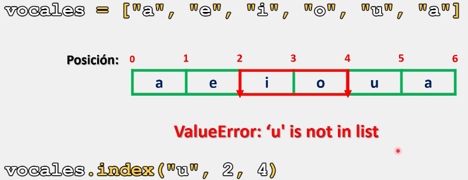

# Listas

En Python, al trabajar con los elementos que conforman a una lista, surge la necesidad de buscar un elemento en específico, ya sea para eliminarlo, o bien, para manipularlo de acuerdo a nuestras necesidades.

Para dar solución a esta situación, en Python contamos con el método **index()**, el cual nos permite localizar dentro de una lista un elemento en especifico.

El método index() devuelve un valor de tipo entero el cual representa el índice de la primera coincidencia del elemento especificado a encontrar.

Este método nos permite trabajar con mínimo un argumento y máximo tres argumentos de manera simultánea.

## Sintaxis

La sintaxis para utilizar el método index() es la siguente:

```python
# Este método trabaja con un minimo de un argumento y un máximo de tres:

# Trabajando con un argumento:
nombre_lista.index(elemento_a_localizar)
# El elemento a localizar puede ser de cualquier tipo de dato

# Trabajando con dos argumentos:
nombre_lista.index(elemento_a_localizar, inicio)

# Trabajando con tres argumentos:
nombre_lista.index(elemento_a_localizar, inicio, final)

# El inicio y final deben ser, obligatoriamente, elementos de tipo entero (int)
```

Ahora que ya conocemos la sintaxis del método **index()**, veamos cual es su implementación y comportamiento con algunos ejemplos:

### Trabajando con un argumento:

```python
# Ejemplo 1:

vocales = ["a", "e", "i", "o", "u", "a"]
print(vocales.index("a"))

# Salida: 0
```

Como se observa, este método me devuelve siempre la primera ocurrencia encontrada, ignorando por completo si existen más elementos iguales dentro de la lista.



Ejemplo 2:

```python
# Ejemplo 2:

vocales = ["a", "e", "i", "o", "u", "a"]
print(vocales.index("i"))

# Salida: 2
```



### Trabajando con dos argumentos y tres argumento

Al establecer el segundo argumento (correspondiente a la posición desde la que comenzara a buscar), el método igualmente nos devolverá la primera aparición:

```python
# Ejemplo 3:

vocales = ["a", "e", "i", "o", "u", "a"]
print(vocales.index("u",2))

# Salida: 4
```

Representación grafica:



Ahora, al trabajar con los tres argumentos: **(elemento a buscar, inicio, final)**, Python establecerá un rango en donde realizara la búsqueda:

```python
# Ejemplo 4:

vocales = ["a", "e", "i", "o", "u", "a"]
print(vocales.index("i",2, 4))

# Salida: 2
```

Representación grafica: 



___

Ahora, ¿Qué sucede cuando intentamos buscar un elemento que no existe en nuestra lista?:

```python
# Ejemplo 5:

vocales = ["a", "e", "i", "o", "u", "a"]
print(vocales.index("z"))

# Salida: ValueError: 'z' is not in list
```

Como se observa, Python nos marca un error de valor, donde se nos menciona que el valor buscado no se encuentra dentro de la lista.



Este error se mostrara de igual forma si buscamos un elemento que no existe dentro de un rango dado:

```python
# Ejemplo 6:

vocales = ["a", "e", "i", "o", "u", "a"]
print(vocales.index("e",2))

# Salida: ValueError: 'e' is not in list
```

Como se observa en el ejemplo anterior, el elemento 'e' si existe en la lista, más sin embargo, no existe en el rango que establecimos.



Ejemplo 7:

```python
# Ejemplo 7:

vocales = ["a", "e", "i", "o", "u", "a"]
print(vocales.index("u",2, 4))

# Salida: ValueError: 'u' is not in list
```



Finalmente:

> Se recomienda practicar este tema modificando los parámetros y valores de los ejercicios anteriormente presentados para comprender su funcionamiento. 
