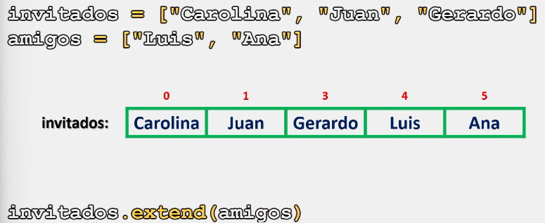
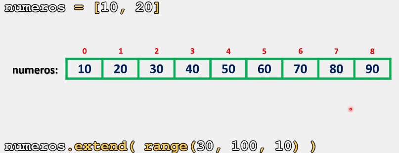

# Listas

Una de las tareas más habituales al trabajar con listas, es concatenarlas, es decir, unir dos o más listas para formar una única lista.

En Python, existen múltiples alternativas para concatenar dos o más listas, entre las que se destacan el método **extend()**

## Método extend()

Este método permite concatenar dos o más listas, y a su vez, nos permite agregar varios elementos a una lista, como elementos individuales a partir de una secuencia.

### Sintaxis.

La sintaxis para utilizar el método **extend()**, es la siguiente:

```python
nombre_lista.extend(objeto_iterable)

# Este método solo funcionará si tiene el argumento, en cualquier otro caso mostrará un error.
```

Ahora que ya conocemos la sintaxis del método **extend()**, veamos cual es su implementación y comportamiento con algunos ejemplos:

```python
# Ejemplo 1:

invitados = ["Carolina", "Juan", "Gerardo"]
amigos = ["Luis", "Ana"]

print(f"Lista amigos {amigos} y lista invitados: {invitados} antes del método")

# Imaginemos que queremos agregar a mis amigos a la lista de invitados:

invitados.extend(amigos)

print(f"nLista amigos {amigos} y lista invitados: {invitados} después del método")

# Salida

# Lista amigos ['Luis', 'Ana'] y lista invitados: ['Carolina', 'Juan', 'Gerardo'] antes del método
#
# Lista amigos ['Luis', 'Ana'] y lista invitados: ['Carolina', 'Juan', 'Gerardo', 'Luis', 'Ana'] después del método
```

Como se observa, este método agrega los elementos del objeto iterable en orden y al final de la lista sobre la que estamos trabajando.



Ejemplo 2:
```python
# Ejemplo 2:

numeros = [10, 20]

print(f"Lista antes del método: {numeros}")

# Imaginemos que queremos completar esta lista con una sucesión de números del 10 al 90 con saltos de 10:

numeros.extend(range(30,100,10))

print(f"\nLista después del método: {numeros}")

# Salida:

# Lista antes del método: [10, 20]
# 
# Lista después del método: [10, 20, 30, 40, 50, 60, 70, 80, 90]
```

Como se observa, el método range() nos genera los números faltantes para completar dicha sucesión.



Finalmente:

> Se recomienda practicar este tema modificando los parámetros y valores de los ejercicios anteriormente presentados para comprender su funcionamiento. 
