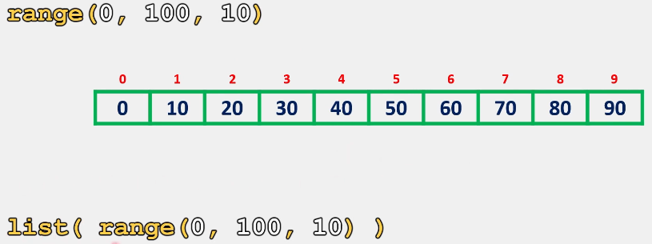
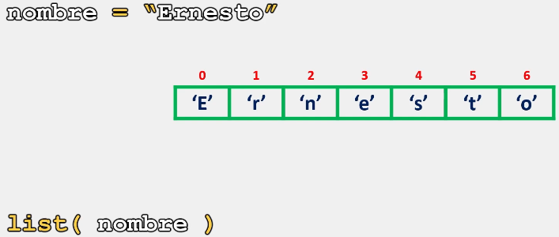

# Listas

En Python, podemos encontrarnos con la necesidad de tener un objeto iterable el cual queremos convertir a una lista, y así manipular cada uno de sus elementos.

Una alternativa para convertir objetos iterables a listas, es utilizar un ciclo, el cual, se encargaría de recorrer cada uno de los elementos, y a su vez, irlos almacenando uno a uno dentro de una lista.

No obstante, esta solución podría ser poco práctica al momento de querer simplificar nuestro código y recursos, ya que necesitaríamos utilizar varios métodos y líneas de código para lograrlo.

Ante esta situación, contamos con el constructor **list()**, el cual nos permite convertir objetos iterables a lista, de una manera rápida, compacta y eficiente.

## Sintaxis

La sintaxis para utilizar el  constructor **list()** es la siguiente:

```python
list(objeto_iterable)
```

Ahora que ya conocemos la sintaxis del método **list()**, veamos cual es su implementación y comportamiento con algunos ejemplos:

```python
# Ejemplo 1:

print(list(range(0,100,10)))

# Salida: [0, 10, 20, 30, 40, 50, 60, 70, 80, 90]
```

Como se observa en el ejemplo anterior, el constructor **list()** convierte los objetos que nos va generando range a una lista.



Lo mismo sucede cuando estamos trabajando con un string:

```python
# Ejemplo 2:

nombre = "Ernesto"
print(list(nombre))

# Salida: ['E', 'r', 'n', 'e', 's', 't', 'o']
```

Como se observa, el constructor separa mi string y almacena cada carácter como un elemento dentro de la lista.



Finalmente:

> Se recomienda practicar este tema modificando los parámetros y valores de los ejercicios anteriormente presentados para comprender su funcionamiento. 