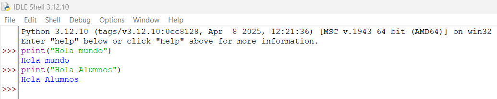
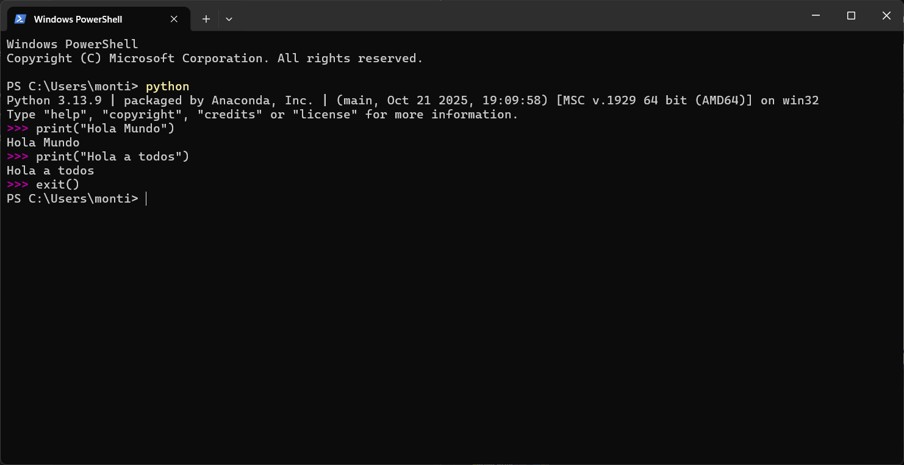

# ¿Qué es un programa?

Un programa es una serie de instrucciones previamente codificadas, las cuales permiten realizar una tarea especifica en una computadora.

A esta serie de instrucciones previamente codificadas, se le conoce como código fuente.
El cual es escrito por personas conocidas como programadores de computadora.

El código, debe ser escrito en un lenguaje de programación, que en este caso será con el lenguaje de programación Python, y que posteriormente puede ser convertido en un archivo ejecutable (.exe).

Para que el código fuente, pueda se convertido en un archivo ejecutable, es necesario la ayuda de un compilador, y posteriormente ser ejecutado en la Unidad Central de Procesamiento (CPU), con la ayuda de un intérprete.

## ¿Qué es un compilador?
Un compilador, es un tipo de traductor que transforma un programa entero de un lenguaje de programación (llamado código fuente), a lenguaje máquina, para que posteriormente pueda se ejecutado.

* ***A este proceso de traducción se conoce como compilación**

## ¿Qué es un interprete?
Los intérpretes se diferencian de los copiladores, en que mientras el compilador traduce un programa desde su descripción en un lenguaje de programación al código de máquina del sistema, los intérpretes sólo realizan la traducción a medida que sea necesaria, típicamente, instrucción por instrucción, y normalmente no guardan el resultado de dicha traducción.

## En conclusión

Un programa de computadora bajo la forma de lenguaje de programación el cual es legible para un humano, se le llama código fuente, y dicho código fuente se puede convertir en un ejecutable por un compilador, o bien, ejecutarse inmediatamente con la ayuda de un intérprete. 

___
# Diferencia grafica entre Interprete y compilador.

## Interprete:

El Shell de Python

El interprete "traduce" line a por línea. La terminal de Windows puede funcionar al igual que un interprete para Python:

## Compilador

Código:

	print("Hola mundo")
	print("Estoy aprendiendo Python")

Para poder ejecutar el código es necesario guardar primero el archivo y después presionar en "Run". Es necesario acostumbrarnos a especificar que tipo de archivo es con la terminación ".py".

Si no se tiene la función de ejecutar el código, como sucede con el block de notas, se puede ejecutar desde la terminal ingresando a la ubicación del archivo para posteriormente escribir **python NOMBRE_DEL_ARCHIVO** o **python RUTA_DEL_ARCHIVO**

