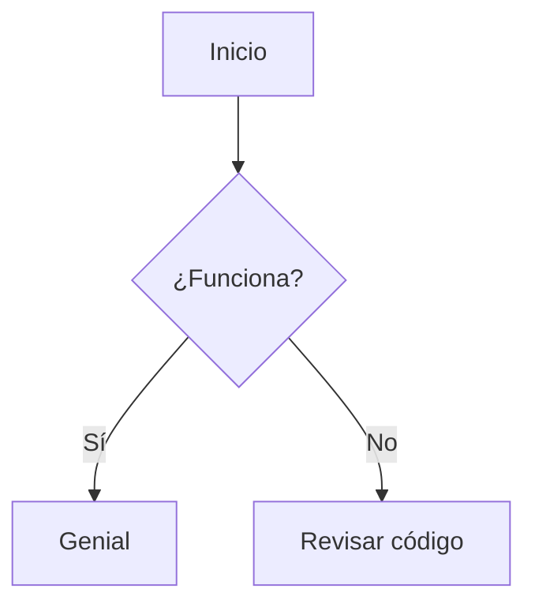

# Práctica propuesta #1

La compañía multinacional Rappi solicita un sistema que determine los días de vacaciones a los que tiene derecho un trabajador, tomando en cuenta las siguientes características:

## Departamentos:

> Existen **tres departamentos** dentro de la compañía con sus respectivas claves:
> 	1. Departamento de Atención al cliente. (Clave 1)
> 	2. Departamento de Logística. (Clave 2)
> 	3. Gerencia. (Clave 3)

### Trabajadores con Clave 1 (Atención al cliente):

* Con 1 año de servicio, reciben 6 días de vacaciones.
* Con 2 a 6 años de servicio, reciben 14 días de vacaciones.
* A partir de 7 años de servicio, reciben 20 días de vacaciones.

### Trabajadores con Clave 2 (Logística):

* Con 1 año de servicio, reciben 7 días de vacaciones.
* Con 2 a 6 años de servicio, reciben 15 días de vacaciones.
* A partir de 7 años de servicio, reciben 22 días de vacaciones.

### Trabajadores con Clave 3 (Gerencia):

* Con 1 año de servicio, reciben 10 días de vacaciones.
* Con 2 a 6 años de servicio, reciben 20 días de vacaciones.
* A partir de 7 años de servicio, reciben 30 días de vacaciones.

## Requerimientos indispensables:

* El sistema debe de solicitar el **Nombre, Clave del Departamento y Antigüedad** del trabajador desde teclado.
* Posteriormente el programa debe mostrar un mensaje en pantalla que contenga **el nombre del trabajador y los días de vacaciones a los que tiene derecho.**
* Debe contar con sistema de validación para datos no contemplados: **claves inexistentes** y **años de servicio no suficientes** 

