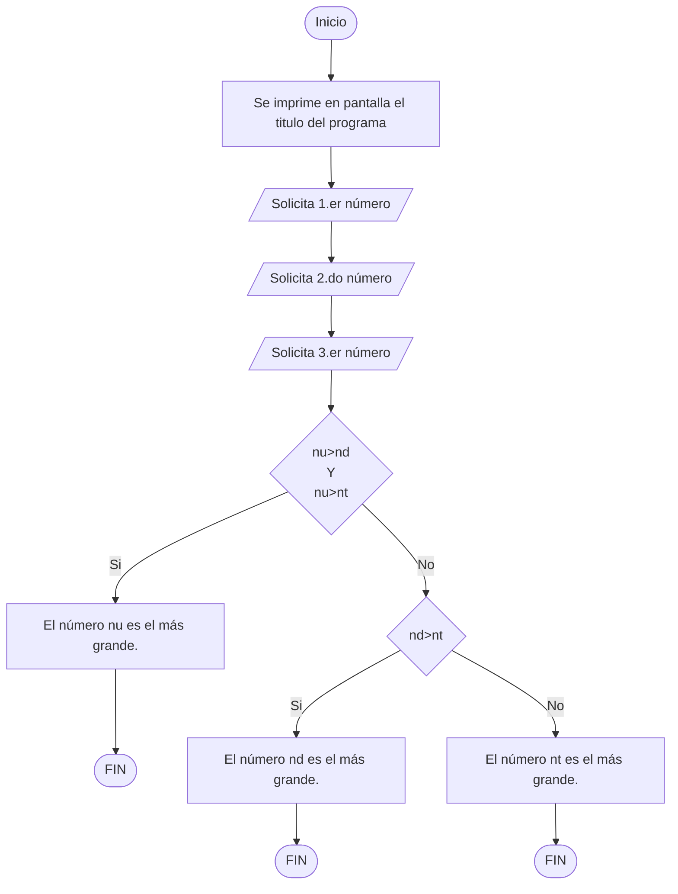

# Practica propuesta #3

Desarrollar un programa que solicite tres números enteros desde teclado al usuario, posteriormente, el programa deberá determinar e indicar a través de un mensaje en pantalla cual de los tres números es el más grande.

## Requerimientos indispensables:

El mensaje en pantalla deberá mostrar el número que resulto ser el más grande de los tres.

Por ejemplo:

* "El número 10 es el número más grande de los tres." 

> Se recomienda realizar el ejercicio por cuenta propia, sin el uso de la Inteligencia Artificial y con todo el conocimiento adquirido hasta el momento.
> 
> Sin embargo, si lo considera necesario, puede guiarse del siguiente diagrama de flujo para resolver el ejercicio:

Donde:
* **nu**: Corresponde al primer número
* **nd**: Corresponde al segundo número
* **nt**:  Corresponde al tercer número 

