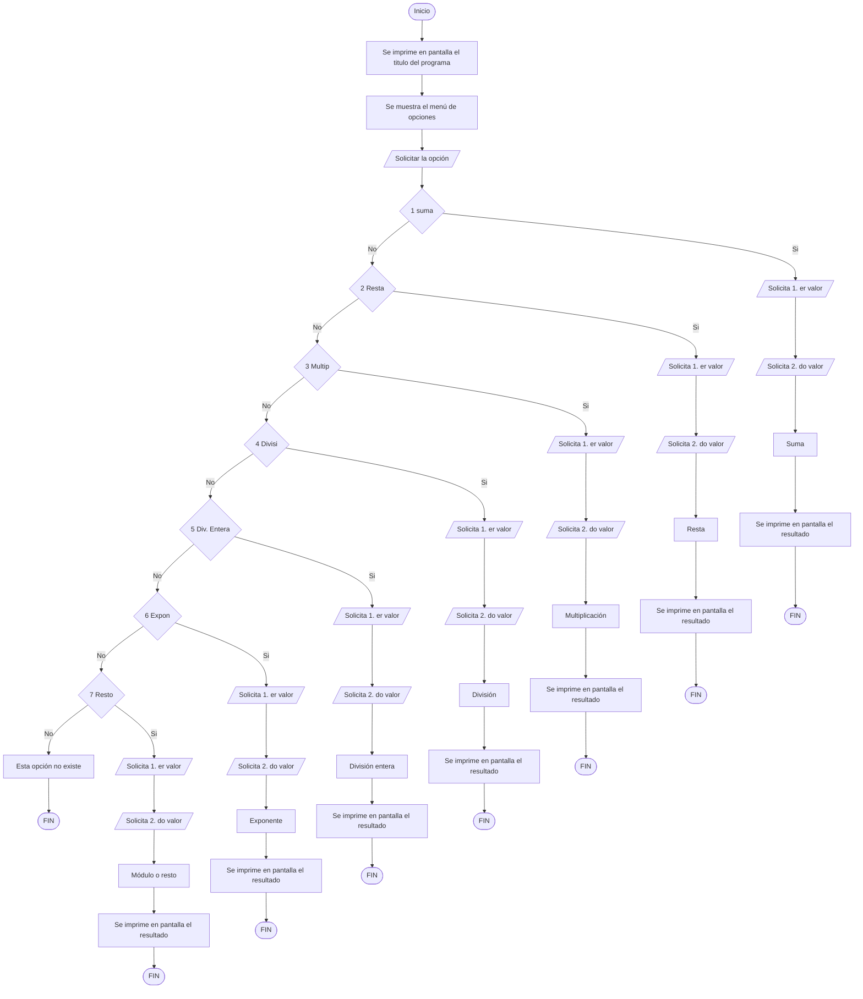

# Practica Propuesta #4:

Desarrollar una calculadora con las siguientes características:

1. La calculadora deberá ser capaz de calcular las operaciones de **suma, resta, multiplicación, división, división entera, exponente y módulo o resto.**
2. La calculadora deberá de tener un menú de opciones donde el usuario pueda elegir cual es la operación que desea ejecutar.
3. La calculadora deberá solicitar únicamente dos valores por cada operación.

## Requerimientos indispensables:

> El código de este programa deberá funcionar con una única variable que se llamara **numero**, es decir, no se permite la implementación de otra variable.

Puede guiarse con el siguiente ejemplo:

```python
# Calculadora con una sola variable

# Ejemplo de menú:

'********************'
'* Menú de opciones *'
'********************'
'1. Suma'
'2. Resta'
'3. Multiplicación'
'4. División'
'5. División entera'
'6. Exponente'
'7. Modulo o resto'

# Ejemplo de funcionamiento:

'Introduce la opción deseada: '
# Ingresamos 2 (Que corresponde a la resta)

'Introduce el primer número: '
# Ingresamos 10

'Introduce el segundo número: '
# Ingresamos 5

# Salida: El resultado de la resta es: 5


# Recordemos que, para esto, solo utilizamos una variable llamada 'numero'. El uso de mas variables esta prohibido.
```

> Se recomienda realizar el ejercicio por cuenta propia, sin el uso de la Inteligencia Artificial y con todo el conocimiento adquirido hasta el momento.
> 
> Sin embargo, si lo considera necesario, puede guiarse del siguiente diagrama de flujo para resolver el ejercicio:



