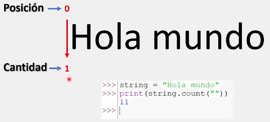
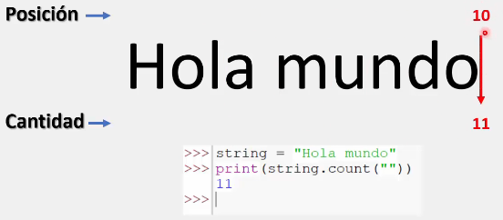
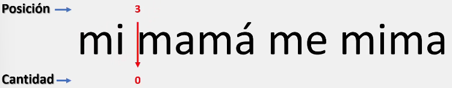
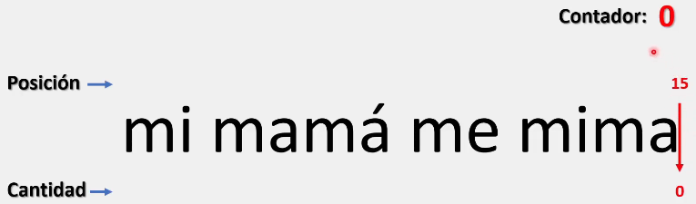
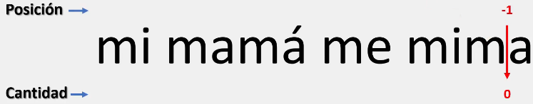
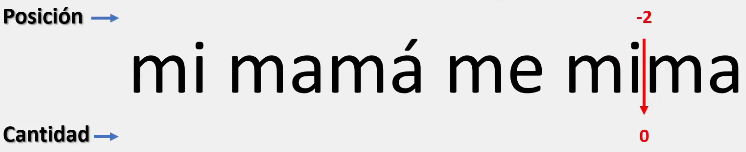
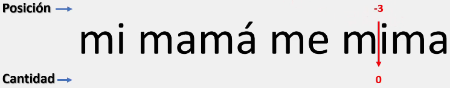
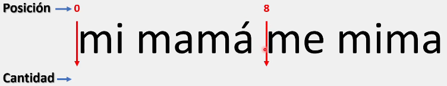
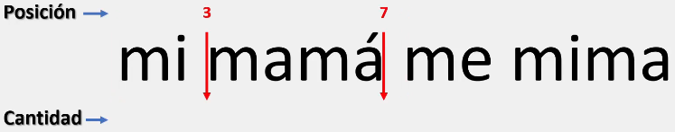
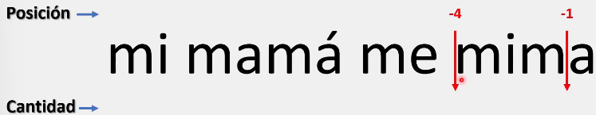

# El método cout()

En Python, el método count() es de gran utilidad cuando tenemos la necesidad de conocer la cantidad de veces que aparece una cadena o carácter en especifico dentro de un texto.

De manera predeterminada, el método count() se encargará de buscar una subcadena en particular dentro de todo el contenido que compone a una cadena en especifico.

Además, el método count() tiene la capacidad de buscar una subcadena en una parte en especifico de la cadena principal.

La sintaxis para el método count() es la siguiente: 

```python
nombre_variable.count("substring", int, int)

# Este método trabaja con argumentos, por lo que es importante siempre colocar algo en su interior para evitar errores al momento de ejecutar.
# Este método puede trabajar con uno y un máximo de tres argumentos al mismo tiempo.

# El primer argumento ("substring") es la cadena de texto que queremos encontrar.

# El segundo y tercer argumento ("int") corresponden a valores enteros.
```

___
## Probando el método con un argumento.

### El método count() con un argumento sin especificar la subcadena

El método count(), cuando no se especifica ningún substring a buscar, este nos muestra el tamaño de nuestra cadena mas uno:

Por ejemplo, el string "Hola mundo" tiene una longitud de diez:


Pero, si nosotros ejecutamos la siguiente línea de código, el método nos mostrara 11:

```python
string = "Hola mundo"
print(string.count("")) # Colocamos un argumento, pero no indicamos ninguna subcadena dentro de los parentesis

# Salida: 11
```

Como no especificamos una subcadena, el método, al colocarse en la primera posición determina que ya tiene un primer carácter:



A partir de ahí avanzara hasta el extremo derecho (la posición 10), habiendo encontrado una cantidad de 11 caracteres:



### El método count() con un argumento especificando la subcadena.

Cuando especificamos la subcadena a buscar, Python buscara en nuestra cadena original todas las coincidencias. Ejemplo:

```python
string = "mi mamá me mima"
print(string.count("m"))

# Salida: 6
```

En el caso anterior, la letra 'm' en minúscula se repite 6 veces.
Es importante tener en cuenta que este método, al igual que muchos dentro de Python, diferencia las mayúsculas de las minúsculas:

```python
string = "mi mamá me mima"
print(string.count("M"))

# Salida: 0
```

Algunos ejemplos más para comprender este método son:

```python
string = "mi mamá me mima"
print(f'La subcadena "ma" aparece {string.count("ma")} veces en: "{string}"')
print(f'La subcadena "má" aparece {string.count("má")} veces en: "{string}"')
print(f'La subcadena "i" aparece {string.count("i")} veces en: "{string}"')

# Salida: La subcadena "ma" aparece 2 veces en: "mi mamá me mima"
#         La subcadena "má" aparece 1 veces en: "mi mamá me mima"
#         La subcadena "i" aparece 2 veces en: "mi mamá me mima"
```

___
## Probando el método con dos y tres argumentos.

### El método count() con dos argumentos.

Al colocar el segundo argumento (que debe ser un número entero), Python empezara a buscar las coincidencias a partir de esa posición, ignorando las coincidencias anteriores a la misma. Ejemplo:

```python
string = "mi mamá me mima"
print(string.count("m",3))

# Salida: 5
```

Como se observa a continuación, Python ignora la primera coincidencia, dejándonos un total de 5 coincidencias restantes.



Pero, ¿Qué pasa si coloco un argumento que supera la longitud de mi cadena? como por ejemplo:

```python
string = "mi mamá me mima"
print(string.count("m",100))

# Salida: 0
```

El numero 100; correspondiente a nuestro segundo argumento, es mayor que 15; correspondiente a la longitud de la cadena "mi mamá me mima".

Al ejecutar este programa, Python se coloca en la última posición, en este caso 15, y como ya no tiene nada que recorrer, encuentra un total de 0 coincidencias.



Y, ¿si en su lugar colocamos un número negativo?

```python
string = "mi mamá me mima"
print(string.count("m",-1))

# Salida: 0
```

En el lenguaje de programación Python sucede algo muy peculiar cuando trabajamos con números negativos para indicar una posición. Ya que, en lugar de empezar el recorrido de izquierda a derecha (desde la posición cero a la 15 en nuestro caso), Python se coloca en la posición correspondiente de derecha a izquierda antes de realizar su recorrido normal:



Ejemplo con -2:

```python
string = "mi mamá me mima"
print(string.count("m",-2))

# Salida: 1
```

Donde Python primero se coloca en la posición indicada antes de realizar su recorrido de izquierda a derecha y encontrar la primera coincidencia.



Ejemplo con -3:

```python
string = "mi mamá me mima"
print(string.count("m",-3))

# Salida: 1
```



Esto se repetirá de manera sucesiva con los valores negativos.

### El método count() con tres argumentos.

Al colocar el tercer argumento (que debe ser igualmente un número entero), Python empezara a buscar las coincidencias a partir de la posición indicada por el segundo argumento y terminando en la posición indicada por el tercero, ignorando las coincidencias tanto anteriores como posteriores. Ejemplo:

```python
string = "mi mamá me mima"
print(string.count("m", 0, 8))

# Salida: 3
```

Como se observa a continuación, Python ignora las ultimas tres coincidencias, dejándonos un total de 3 coincidencias restantes (Trabajando solo en el intervalo especificado).



Otro ejemplo es:

```python
string = "mi mamá me mima"
print(string.count("m", 3, 7))

# Salida: 2
```

Donde, de igual forma, Python restringe la búsqueda a las posiciones indicadas en los argumentos. 



Al igual que en casos anteriores, si colocamos números mayores a la longitud de nuestra cadena, Python, al no poder recorrer más posiciones, nos devuelve cero:

```python
string = "mi mamá me mima"
print(string.count("m", 100, 100))

# Salida: 0
```

Con los números negativos, Python primero se ubica en el rango especificado antes de realizar su recorrido en dicho rango:

```python
string = "mi mamá me mima"
print(string.count("m", -4, -1))

# Salida: 2
```




>Para comprender mejor este tema, se recomienda trabajar con los ejemplos anteriores realizando modificaciones para observar los resultados.