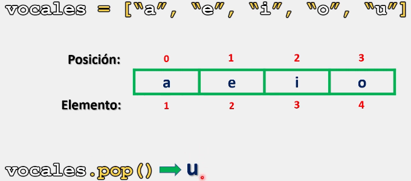
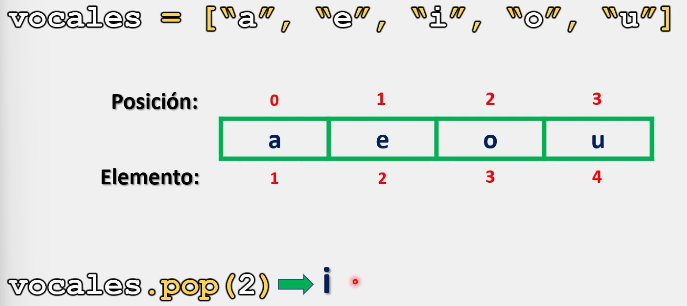
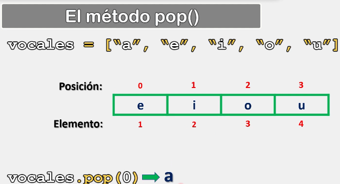
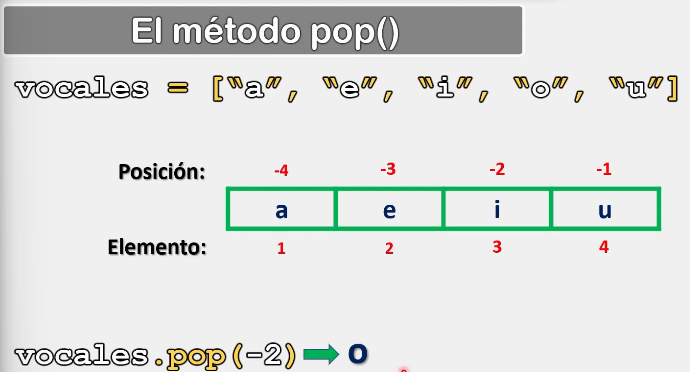
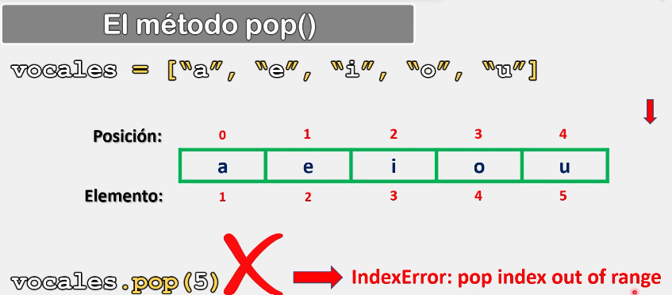

# Listas

En Python, al trabajar con listas, además de agregar y acceder a elementos, es posible eliminar elementos de una lista, ya sea el último elemento, o bien, un elemento en especifico.

## El método pop().

Para lograr eliminar elementos de una lista, contamos con el método pop(), el cual, nos permite acceder a la lista y eliminar ya sea el último elemento, o bien, un elemento en específico, para lo cual, se debe especificar su posición exacta dentro de la lista.

### Sintaxis.

La sintaxis para utilizar el método pop(), es la siguiente:

```python
nombre_lista.pop() # De esta forma Python elimina el último elemento de la lista

nombre_lista.pop(posición) # De esta forma Python elimina el elemento especificado, el cual, debe ser un número entero.
```

Ejemplo 1:

```python
# Ejemplo 1:

vocales = ["a", "e", "i", "o", "u"]
print(vocales.pop())
print(vocales)

# Salida:

# u
# ['a', 'e', 'i', 'o']
```

Algo interesante que tiene el método pop() es que siempre nos retornara el valor que se acaba de eliminar:



Ejemplo 2:

```python
# Ejemplo 2:

vocales = ["a", "e", "i", "o", "u"]
print(vocales.pop(2))
print(vocales)

# Salida:

# i
# ['a', 'e', 'o', 'u']
```

Al especificar la posición, Python eliminara dicho elemento y también nos devolverá el valor que contenía.



Ejemplo 3:

```python
# Ejemplo 3:

vocales = ["a", "e", "i", "o", "u"]
print(vocales.pop(0))
print(vocales)

# Salida:

# a
# ['e', 'i', 'o', 'u']
```



Ejemplo 4

```python
# Ejemplo 4:

vocales = ["a", "e", "i", "o", "u"]
print(vocales.pop(-2))
print(vocales)

# Salida:

# o
# ['a', 'e', 'i', 'u']
```

Al trabajar con índices negativos, recordemos que Python empezara a contar desde la derecha a la izquierda:



Por ultimo, cuando declaramos un argumento mayor al número de posiciones que tiene nuestra lista, Python nos arrojara un error de indice:

```python
# Ejemplo 5:

vocales = ["a", "e", "i", "o", "u"]
print(vocales.pop(5))
print(vocales)

# Salida:

# IndexError: pop index out of range
```



> Se recomienda practicar este tema modificando los parámetros y valores de los ejercicios anteriormente presentados para comprender su funcionamiento. 