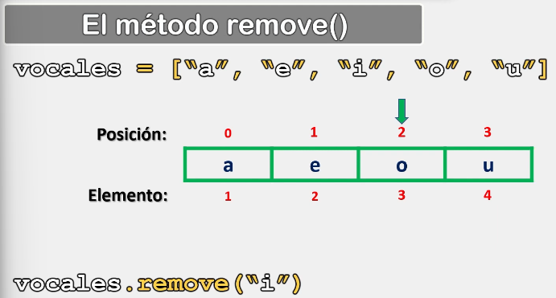
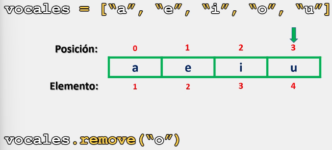
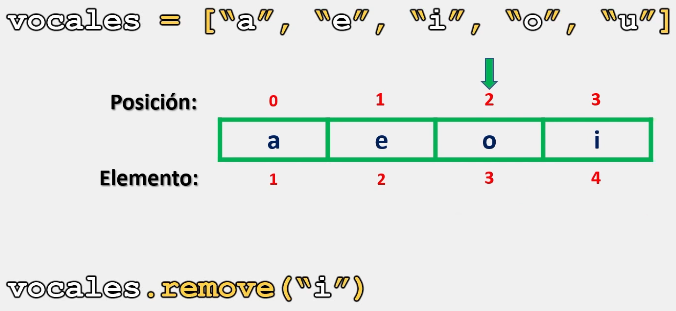
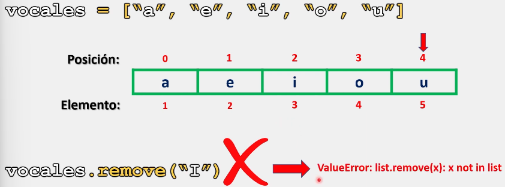

# Listas

En Python, al trabajar con listas, es posible eliminar un elemento especificando el elemento a eliminar a diferencia del método pop() donde tenemos que especificar la posición exacta dentro de la lista para poder eliminar dicho elemento.

Para esta situación contamos con el método remove(), el cual nos permite eliminar un elemento dentro de una lista, especificando a través de un argumento, ele elemento que deseamos eliminar,

## Sintaxis

La sintaxis para utilizar el método remove() es la siguiente:

```python
nombre_lista.remove(elemento_a_eliminar)

# Este elemento trabaja con un solo argumento y es necesario para el correcto funcionamiento.
```

Ejemplo 1:

```python
# Ejemplo 1:

vocales = ["a", "e", "i", "o", "u"]
vocales.remove("i") # Es importante que el elemeto especificado este dentro de la lista.

print(vocales)

# Salida : ['a', 'e', 'o', 'u']
```

Como se observa en el ejemplo anterior, Python elimina correctamente el elemento especificado:



Ejemplo 2:

```python
# Ejemplo 2:

vocales = ["a", "e", "i", "o", "u"]
vocales.remove("o") 

print(vocales)

# Salida : ['a', 'e', 'i', 'u']
```



___

Ahora, ¿Qué sucede cuando queremos eliminar un elemento que esta en nuestra lista dos veces o más?

```python
# Ejemplo 3:

vocales = ["a", "e", "i", "o", "i"]
vocales.remove("i") 

print(vocales)

# Salida : ['a', 'e', 'o', 'i']
```

Como se observa, Python solo elimina la primera ocurrencia, es decir, no elimina más de un elemento.



Ahora, si nuestro elemento no esta en la lista, Python nos arrojara un error:

```python
# Ejemplo 4:

vocales = ["a", "e", "i", "o", "i"]
vocales.remove("I") # Este método tambien distingue las mayúsculas de las minusculas

print(vocales)

# Salida : ValueError: list.remove(x): x not in list
```



> Se recomienda practicar este tema modificando los parámetros y valores de los ejercicios anteriormente presentados para comprender su funcionamiento. 