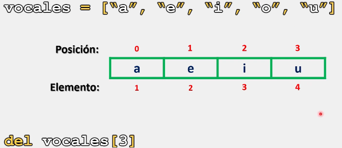
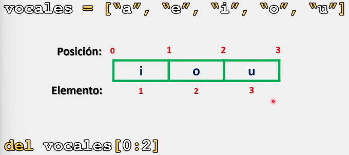
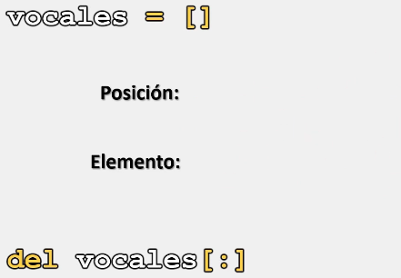

# Listas

En Python, al trabajar con listas, además de poder eliminar uno o varios elementos de una lista, es posible eliminar toda una lista.

Para lograrlo, contamos con la instrucción **- del -**, la cual nos permite eliminar toda una lista, y a su vez, nos permite eliminar un único elemento indicando la posición exacta del elemento.

O bien, eliminar dos o más elementos de manera simultanea indicando el rango de las posiciones que ocupan los elementos a eliminar

## Sintaxis

La sintaxis para utilizar la instrucción **- del -** es la siguiente:

```python
del nombre_lista # Elimina toda la lista

del nombre_lista[posición] # De esta forma, Python solo eliminara el elemento especificado. La posición debe ser siempre un número entero.

del nombre_lista[posición : posición] # De esta forma, Python eliminar un rango de elementos especificados. Ambas posiciones deben ser números enteros.
```

Ejemplo 1: 

```python
# Ejemplo 1:

vocales = ["a", "e", "i", "o", "u"]
del vocales[3]

print(vocales)

# Salida: ['a', 'e', 'i', 'u']
```

Representación grafica:



Ahora, cuando queremos eliminar más de un elemento de una lista, podemos especificar el rango dentro de los corchetes:

```python
# Ejemplo 2:

vocales = ["a", "e", "i", "o", "u"]
del vocales[0:2]

print(vocales)

# Salida: ['i', 'o','u']
```

Ejemplo grafico:



Cuando no especificamos el valor de inicio y final de nuestro rango, o tomamos todos las posiciones de la misma, la instrucción **- del -** tomara toda nuestra lista y eliminara todos sus elemento, dejándonos con una lista vacía:

```python
# Ejemplo 3:

vocales = ["a", "e", "i", "o", "u"]
del vocales[:]

print(vocales)

# Salida: []
```

Cabe señalar que una **lista vacía**, expresada solo con dos corchetes sin ningún elemento en su interior, sigue estando disponible para agregar elementos, es decir, sigue existiendo:



Ahora, si queremos eliminar completamente una lista, podemos realizarlo de la siguiente manera:

```python
# Ejemplo 4:

vocales = ["a", "e", "i", "o", "u"]
del vocales

print(vocales)

# Salida: NameError: name 'vocales' is not defined. Did you mean: 'locals'?

# Esta forma de usar la instrucción provoca que la lista sea eliminada completamente y, al intentar imprimirla o trabajar en ella, nos lanzará un error donde se nos menciona que dicha lista no esta definida.
```

Como se observa, al aplicar la instrucción **- del -**; sin indicar una posición o rango, esta eliminara completamente la lista, es decir, ya no se podrá acceder y trabajar en ella.

> Se recomienda practicar este tema modificando los parámetros y valores de los ejercicios anteriormente presentados para comprender su funcionamiento. 