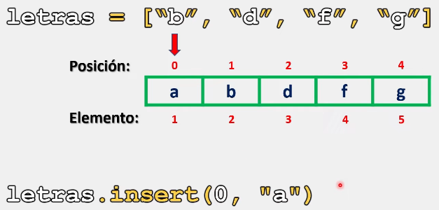

# Listas

En Python, es posible insertar elementos dentro de una lista en una posición determinada.

Con lo cual, podremos establecer el orden y organización de todos los elementos que conformen a nuestras listas.

Para esta situación, contamos con el método insert(), que a diferencia del método append(), nos permite indicar la posición exacta dentro de la lista donde queremos agregar el nuevo elemento

## Sintaxis

La sintaxis para utilizar el método insert() es la siguiente:

```python
nombre_lista.insert(posicion, nuevo_elemento)
# Este metodo solo funcionara agregando los dos argumento entre sus parentesis que representa la posición y el elemento que deseamos agregar.

# Donde la posición debe ser un número entero (int)
```

## Método insert()

Para comprender el funcionamiento e implementación de este método dentro del código, veamos algunos ejemplos:

```python
# Ejemplo 1:

letras = ["b", "d", "f", "g"]
print(f"Lista antes del cambio: {letras}")
letras.insert(0,"a")
print(f"Lista despues del método append(): {letras}")
# Salida:

# Lista antes del cambio: ['b', 'd', 'f', 'g']
# Lista despues del método append(): ['a', 'b', 'd', 'f', 'g']
```

Como se observa, el elemento que deseamos insertar se agrega en la posición cero:



Ejemplo 2:


