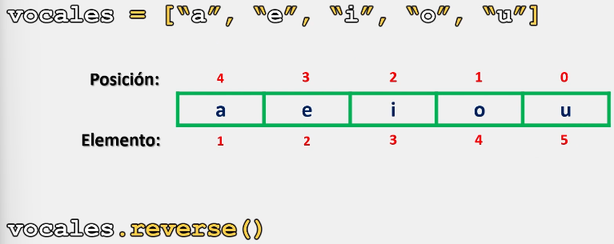

# Listas

En Python, al trabajar con listas, en ocasiones nos podemos encontrar con la necesidad de invertir los elementos de una lista.

Invertir una lista significa que el primer elemento de una lista se convertirá en el ultimo elemento, el segundo elemento en el penúltimo y así sucesivamente.

## Método reverse()

En Python existen diversas manera de invertir una lista, y una de ellas, es utilizar el método **reverse()**, el cual, se encarga de invertir los elementos de una lista en su mismo lugar.

Es decir, el método **reverse()** modifica las posiciones de la lista actual en lugar de crear una nueva lista.
### Sintaxis

La sintaxis para utilizar el método **reverse()** es la siguiente:

```python
nombre_lista.reverse()
```

Ahora que ya conocemos la sintaxis de este método, veamos cual es su implementación y comportamiento:

```python
# Ejemplo 1:

vocales = ["a", "e", "i", "o", "u"]

print(f"Lista antes de la instrucción: {vocales}")

vocales.reverse()

print(f"Lista después de la instrucción: {vocales}")

# Salida:

# Lista antes del metodo: ['a', 'e', 'i', 'o', 'u']
# Lista después del metodo: ['u', 'o', 'i', 'e', 'a']
```

Lo que hace este método por detrás es modificar las posiciones de los elementos, por lo cual no es necesario crear otra lista para lograr invertirlos:



Por último, veamos otro ejemplo:

```python
# Ejemplo 2:

vocales = ["a", "e", "i", "o", "u"]

print(f"Lista antes de la instrucción: {vocales}")

vocales.reverse()

print(f"Lista después de la instrucción: {vocales}")

vocales.reverse()

print(f"Lista después de la instrucción por segunda vez: {vocales}")

# Salida:

# Lista antes de la instrucción: ['a', 'e', 'i', 'o', 'u']
# Lista después de la instrucción: ['u', 'o', 'i', 'e', 'a']
# Lista después de la instrucción por segunda vez: ['a', 'e', 'i', 'o', 'u']
```

Finalmente:

> Se recomienda practicar este tema modificando los parámetros y valores de los ejercicios anteriormente presentados para comprender su funcionamiento. 