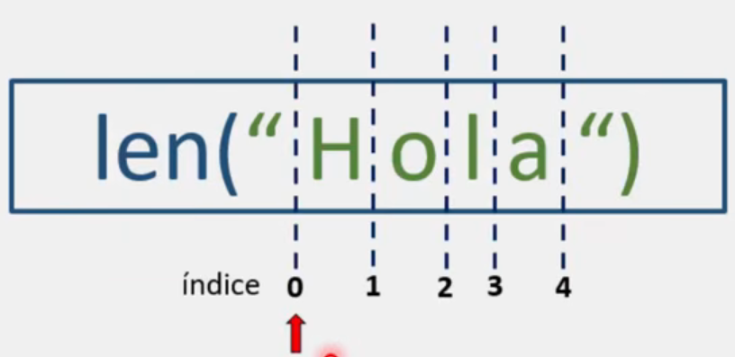
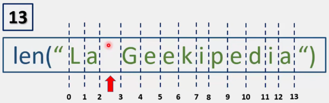

# Función len()

En Python, la función len() nos permite obtener la longitud de una cadena de caracteres, o bien, el número de elementos que componen a un objeto.

La sintaxis correcta para poder utilizar la función len() es la siguiente:

```python
len("Hola")

# Al interior de los parentesis ira el objeto del cual queremos conocer la cantidad de elementos que lo componen o la cadena de caracteres de la cual queremos conocer su longitud.
```

## Comportamiento de la función len()



La función se apoya de un índice señalado con la flecha roja (Los índices lo profundizaremos en la siguiente nota).

Lo que realiza len() es recorrer carácter por carácter hasta llegar al final de la cadena de caracteres, con lo cual determina cuantos caracteres componen a la cadena de texto 

```python
# Al imprimir la función len() o almacenarla en memoria mediante una variable, esta siempre nos dara un numero:

print(len("Hola"))       # Salida: 4 
```

Un detalle a tener en cuenta es que, en una cadena de caracteres, los espacios en blanco también cuentan como un carácter:



```python
longitud = len("La Geekipedia")
print(len(longitud))       # Salida: 13 
```

 > Para comprender esta función, se recomienda replicar el siguiente ejercicio en su computadora:
 
 ```python
 # Función len()
 
 # Opción 1
 print("Hola tiene", len("Hola"), "caracteres.")
 
 # Opción 2
 longitud = len("La Geekipedia")
 print("La Geekipedia tiene", longitud, "caracteres")
 
 # Donde:
 # En la primera opción imprimimos directamente el tamaño con ayuda de print()
 
 # En la segunda opción almacenamos el tamaño de la cadena de texto en una variable
 ```

