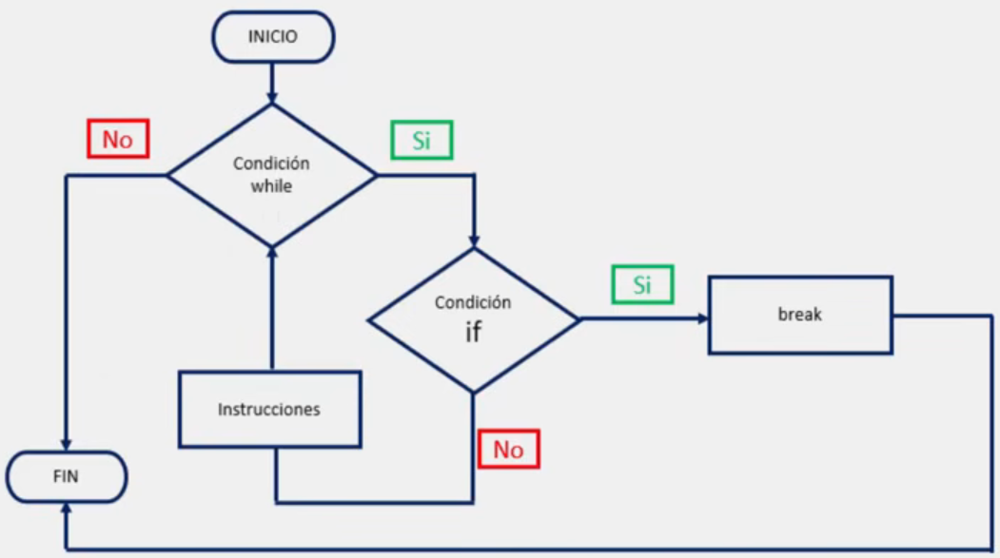
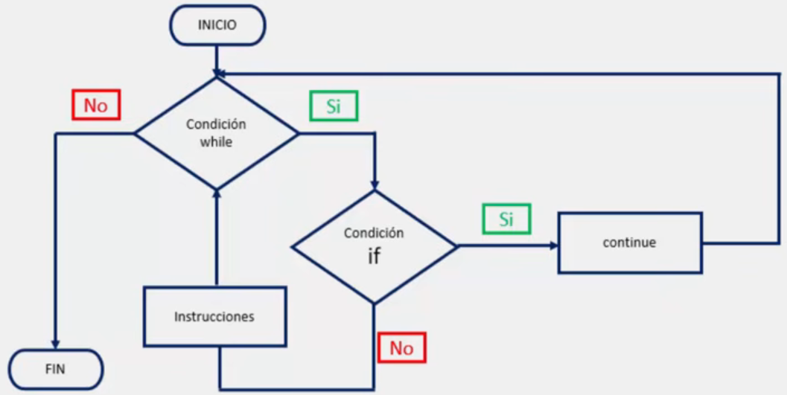

# Sentencias break y continue

En Python, los bucles o ciclos pueden ser interrumpidos, o simplemente, dejar de ejecutar el código que se encuentre dentro del bucle e iniciar una nueva iteración.

Cabe destacar que en programación, una iteración es la repetición de un segmento de código dentro de un programa.

Para lograr la interrupción de una iteración, contamos con las sentencias break y continue.

## Sentencia break

En Python, la sentencia break se utiliza para detener la ejecución de una iteración y salir de ella, con lo cual, el programa podrá continuar con la ejecución del código que se encuentre fuera de nuestro bucle.

Ejemplo de diagrama de flujo para el ciclo while con sentencia break:



Ejemplo de aplicación:

```python
# Ejemplo para break

print("while con la sentencia break")
contador = 0
while contador < 10:
	contador += 1
	
	if contador == 5:
		break
	
	print("Valor actual de la variable:", contador)

print("Fin del programa, la sentencia break se ha ejecutado.")

# Salida:

'''
while con la sentencia break

Valor actual de la variable: 1
Valor actual de la variable: 2
Valor actual de la variable: 3
Valor actual de la variable: 4
Fin del programa, la sentencia break se ha ejecutado.
'''
```

## Sentencia continue

Por otro lado, en Python, también contamos con la sentencia continue, la cual permite detener la iteración actual y volver al principio del bucle para realizar una nueva iteración, si es que la condición que rige a nuestro bucle se sigue cumpliendo.

Recordemos que en programación una iteración es la repetición de un segmento de código dentro de un programa.

Ejemplo de diagrama de flujo para el ciclo while con sentencia continue:



Ejemplo de aplicación:

```python
# Ejemplo para continue

print("while con la sentencia continue")
contador = 0
while contador < 13:
	contador += 1

	if contador % 2 == 0:
		continue
	
	print("Valor actual de la variable:", contador)

# Salida:

'''
while con la sentencia continue

Valor actual de la variable: 1
Valor actual de la variable: 3
Valor actual de la variable: 5
Valor actual de la variable: 7
Valor actual de la variable: 9
Valor actual de la variable: 11
Valor actual de la variable: 13
'''