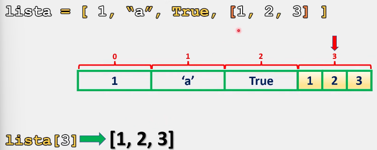
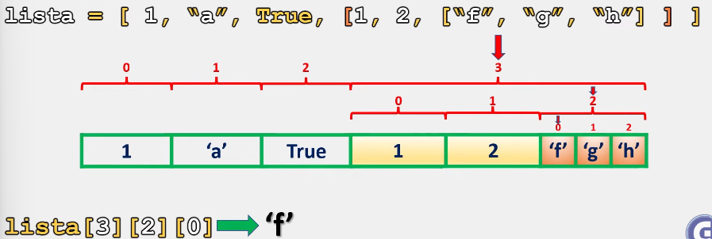

# Listas anidadas

Las listas anidadas son listas dentro de otra lista, es decir:

```python
# Una lista puede contener otra lista en su interior
lista = [1, "a", True, [1, 2, 3] ]
```

Ahora accedamos a los elementos de nuestra primera lista:

```python
print(lista[0])    # Salida: 1
print(lista[1])    # Salida: a
print(lista[2])    # Salida: True
print(lista[3])    # Salida: [1, 2, 3]
```

Como se observa, al ingresar a la posición tres (correspondiente a la lista anidada), esta posición nos devuelve la lista en su totalidad:



Ahora, ¿Qué sucede si yo deseo ingresar a cualquiera de las posiciones dentro de la lista anidada?

Para lograr esto debemos especificar primero la posición de nuestra lista anidada y posteriormente el elemento que deseamos:

```python
print(lista[3][0])    # Salida: 1
print(lista[3][1])    # Salida: 2
print(lista[3][2])    # Salida: 3
```

Como se observa en el ejemplo anterior: 

\>> El primer par de paréntesis representa la posición de la lista anidada.
\>> El segundo par representa la posición de los elementos contenidos en dicha lista.

Veamos otro ejemplo:

```python
lista = [1, "a", True, [1, 2, ["f", "g", "h"] ] ]

# Como se observa, ahora contamos con una lista triple anidada. Veamos algunos ejemplos de como acceder a sus elementos:

# Accediendo a la primera lista y sus elementos:
print(lista)       # Salida: [1, 'a', True, [1, 2, ['f', 'g', 'h']]]
print(lista[0])    # Salida: 1
print(lista[1])    # Salida: a
print(lista[2])    # Salida: True
print(lista[3])    # Salida: [1, 2, ['f', 'g', 'h']]

# Accediendo a los elementos de la segunda lista:
print(lista[3][0])    # Salida: 1
print(lista[3][1])    # Salida: 2
print(lista[3][2])    # Salida: ['f', 'g', 'h']

# Accediendo a los elementos de la tercera lista:
print(lista[3][2][0])    # Salida: f
print(lista[3][2][1])    # Salida: g
print(lista[3][2][2])    # Salida: h
```

Como observamos, ingresar a los elementos de una lista anidada es sencillo. Solo es necesario ubicar el elemento deseado y las posiciones de cada lista.



> Se recomienda practicar este tema modificando los parámetros y valores de los ejercicios anteriormente presentados para comprender su funcionamiento. 