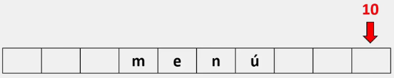
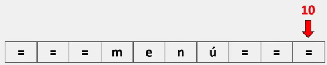
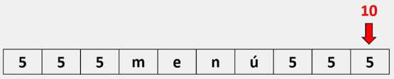
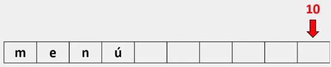
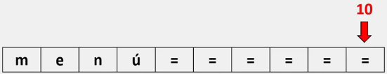
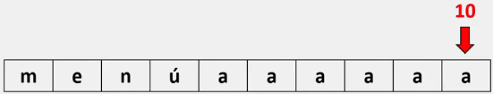
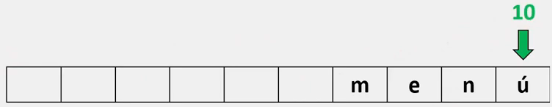
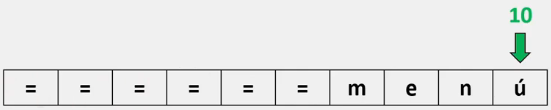
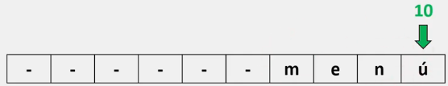

# Métodos de formato.

En Python, es posible alinear el texto que imprimimos en pantalla de acuerdo a nuestras necesidades, es decir, podemos alinear una impresión en pantalla a la izquierda, a la derecha o al centro.

Para poder realizar esta acción, contamos con tres métodos de gran utilidad, los cuales son: **center(), ljust() & rjust().**

## Método center()

Este método nos permite centrar un String, añadiendo espacios o caracteres según nosotros lo indiquemos, tanto al inicio y al final del String, para posteriormente mostrarnos el mismo String, pero con los cambios realizados.

La sintaxis para el método center es la siguiente:

```python
nombre_variable.center(10, "=")

# Este método trabaja con argumentos, por lo que es importante siempre colocar algo en su interior para evitar errores al momento de ejecutar.
# Este método puede trabajar con uno o dos argumentos al mismo tiempo.

# El primer argumento (ejemplo el '10') debe ser SIEMPRE un numero entero y MAYOR a la longitud del string en tu variable. Cualquier otro caso provocara un error al ejecutar.

# El segundo argumento (ejemplo el símbolo '=') corresponde a un carácter y que siempre debe cumplir la condición de ser único. Es decir, si escribimos "==", el programa nos mostraría un error. 
```

> Para comprender de manera correcta como se comporta e implementa el método center(), veamos el ejemplo:

Supongamos que tenemos un String el cual queremos centrar:

```python
string = "menú"   # La longitud de este string es de cuatro.
string.center(10)
```

Al trabajar con este método y un solo argumento, Python centrará nuestra cadena de texto y agregara espacios en blanco al inicio y final de la cadena hasta completar la longitud especificada en el primer parámetro. Siempre manteniendo nuestra cadena en el centro



```python
string.center(10, "=")
```

Al momento de añadir el segundo argumento, Python remplazara los espacios en blanco 'predeterminados' por el carácter especificado. En este caso: "="



```python
string.center(10, "5")
```

En este caso: "5"



___
## Método ljust()

Este método nos permite alinear un String a la izquierda, añadiendo espacios o caracteres según nosotros lo indiquemos, únicamente al final del String, para posteriormente mostrarnos el mismo String pero con los cambios realizados.

La sintaxis para el método ljust() es la siguiente:

```python
nombre_variable.ljust(10, "=")

# Este método, al igual que el anterior, trabaja con argumentos, por lo que es importante siempre colocar algo en su interior para evitar errores al momento de ejecutar.
# Este método puede trabajar con uno o dos argumentos al mismo tiempo.

# El primer argumento (ejemplo el '10') debe ser SIEMPRE un numero entero y MAYOR a la longitud del string en tu variable. Cualquier otro caso provocara un error al ejecutar.

# El segundo argumento (ejemplo el símbolo '=') corresponde a un carácter y que siempre debe cumplir la condición de ser único. Es decir, si escribimos "==", el programa nos mostraría un error. 
```

>Para comprender de manera correcta como se comporta e implementa el método ljust(), veamos el ejemplo:

Supongamos que tenemos un String el cual queremos alinear a la izquierda:

```python
string = "menú"   # La longitud de este string es de cuatro.
string.ljust(10)
```

Al trabajar con este método y un solo argumento, Python colocara nuestra cadena de texto a la izquierda y agregara espacios en blanco al final de la cadena hasta completar la longitud especificada en el primer parámetro. Siempre manteniendo nuestra cadena al inicio.



```python
string.center(10, "=")
```

Al momento de añadir el segundo argumento, Python remplazara los espacios en blanco 'predeterminados' por el carácter especificado. En este caso: "="



```python
string.center(10, "a")
```

En este caso: "a"



## Método rjust()

Este método nos permite alinear un String a la derecha, añadiendo espacios o caracteres según nosotros lo indiquemos, únicamente al inicio del String, para posteriormente mostrarnos el mismo String pero con los cambios realizados.

La sintaxis para el método rjust() es la siguiente:

```python
nombre_variable.rjust(10, "=")

# Este método, al igual que los anteriores, trabaja con argumentos, por lo que es importante siempre colocar algo en su interior para evitar errores al momento de ejecutar.
# Este método puede trabajar con uno o dos argumentos al mismo tiempo.

# El primer argumento (ejemplo el '10') debe ser SIEMPRE un numero entero y MAYOR a la longitud del string en tu variable. Cualquier otro caso provocara un error al ejecutar.

# El segundo argumento (ejemplo el símbolo '=') corresponde a un carácter y que siempre debe cumplir la condición de ser único. Es decir, si escribimos "==", el programa nos mostraría un error. 
```

>Para comprender de manera correcta como se comporta e implementa el método rjust(), veamos el ejemplo:

Supongamos que tenemos un String el cual queremos alinear a la derecha:

```python
string = "menú"   # La longitud de este string es de cuatro.
string.rjust(10)
```

Al trabajar con este método y un solo argumento, Python primero completara la longitud especificada en el primer parámetro con espacios en blanco y posteriormente colocara nuestra cadena de texto a la derecha. Siempre manteniendo nuestra cadena al final y respetando la longitud especificada.



Al momento de añadir el segundo argumento, Python remplazara los espacios en blanco 'predeterminados' por el carácter especificado. En este caso: "="



```python
string.center(10, "-")
```

En este caso: "-"



> Para comprender mejor este tema, se recomienda realizar el siguiente ejercicio en su computadora modificando las variables y/o las líneas de código:

```python
string = "Menú"

print ("Métodos con espacios:")
print (string.center(20) )
print (string.ljust(20))
print (string.rjust(20) )

print ("\nMetodos con caracter:")
print (string.center(20, "=") )
print (string.ljust(20, "="))
print (string.rjust(20, "="))

print ("\nVariable modificada:")
string = string.center(10, "=")
print (string)

# Salida: Métodos con espacios:
#                 Menú
#         Menú
#                Menú
#
#         Metodos con caracter:
#         ========Menú========
#         Menú================
#         ================Menú
#
#         Variable modificada:
#         ===Menú===
```