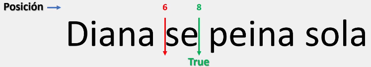
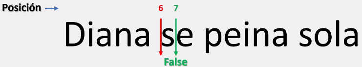
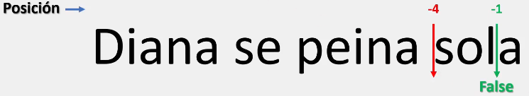
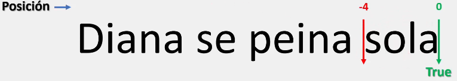
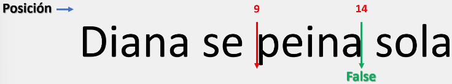
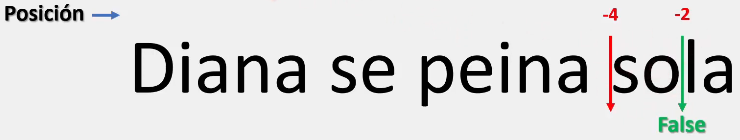

# El método startswith()

Se utiliza para comprobar si una cadena de caracteres comienza con una subcadena en particular.

Además, es posible establecer un rango de búsqueda dentro de  la cadena principal.

La sintaxis para el método startswith() es la siguiente:

```python
variable.startswith()

# Este método trabaja con argumentos, por lo que es importante siempre colocar algo en su interior para evitar errores al momento de ejecutar.
# Este método puede trabajar con uno y un máximo de tres argumentos al mismo tiempo.

# El primer argumento ("substring") es la cadena de texto que queremos comparar.

# El segundo y tercer argumento ("int") corresponden a valores enteros.
```

___
## Probando el método con un argumento:

Este método nos retornara un valor booleano:

```python
string = "Diana se peina sola"
print(string.startswith("D"))

# Salida: True
```

En el caso anterior, el string empieza con la subcadena "D", por lo que Python devuelve **True**

Sin embargo, este método también distingue entre mayúsculas y minúsculas:

```python
string = "Diana se peina sola"
print(string.startswith("d"))

# Salida: False
```

Otro ejemplo con este método es:

```python
string = "Diana se peina sola"
print(string.startswith("Diana"))

# Salida: True
```

Donde, como se observa en el ejercicio anterior, efectivamente nuestro string empieza con la subcadena "Diana"

## Probando el método con dos argumentos:

Al igual que con el método [count()](Primera%20parte/El%20método%20count().md), el primer argumento corresponde a la posición de la que empezara a contar nuestro método:

```python
string = "Diana se peina sola"
print(string.startswith("se", 6))

# Salida: True
```



## Probando el método con tres argumentos:

Al trabajar con tres argumentos, lo que hacemos es establecer un rango donde Python trabajara: 

```python
string = "Diana se peina sola"
print(string.startswith("se", 6, 7))

# Salida: False
```

Como se observa a continuación, el método, al estar buscando una subcadena de mayor longitud al rango dado, este método nos devuelve un False: 



Además, es importante mencionar que podemos trabajar con números negativos:

```python
string = "Diana se peina sola"
print(string.startswith("se", -4, -1))

# Salida: False
```

Donde, al buscar la subcadena "se" y no encontrarla, Python nos devuelve False



Igualmente, podemos trabajar con valores que superen la longitud de nuestra cadena:

```python
string = "Diana se peina sola" # Tiene 19 pocisiones
print(string.startswith("se", 100, 100))

# Salida: False
```

Como el string no tiene tantas posiciones y no puede realizar el recorrido, Python nos devolverá False

___

# El método endswith()

Se utiliza para comprobar si una cadena de caracteres termina con una subcadena en particular.

Además, es posible establecer un rango de búsqueda dentro de la cadena principal.

La sintaxis para el método endswith() es la siguiente:

```python
variable.endswith()

# Este método trabaja con argumentos, por lo que es importante siempre colocar algo en su interior para evitar errores al momento de ejecutar.
# Este método puede trabajar con uno y un máximo de tres argumentos al mismo tiempo.

# El primer argumento ("substring") es la cadena de texto que queremos comparar.

# El segundo y tercer argumento ("int") corresponden a valores enteros.
```

___
## Probando el método con un argumento:

Este método nos retornara un valor booleano:

```python
string = "Diana se peina sola"
print(string.endswith("a"))

# Salida: True
```

En el caso anterior, el string termina con la subcadena "a", por lo que Python devuelve **True**

Sin embargo, este método también distingue entre mayúsculas y minúsculas:

```python
string = "Diana se peina sola"
print(string.endswith("A"))

# Salida: False
```

Otro ejemplo con este método es:

```python
string = "Diana se peina sola"
print(string.endswith("sola"))

# Salida: True
```

Donde, como se observa en el ejercicio anterior, efectivamente nuestro string termina con la subcadena "sola"



Este método trabaja de manera similar a startswith() con dos argumentos, donde el segundo argumento limita la cadena a un espacio de búsqueda y a partir de ahí realiza la comparación del ultimo elemento de la cadena.

## Probando el método con tres argumentos.

Al trabajar con tres argumentos definimos un rango de búsqueda donde Python compara si nuestra cadena termina con el substring especificado:

```python
string = "Diana se peina sola"
print(string.endswith("s", 9, 14))

# Salida: False
```

Como se observa, el rango a evaluar no termina con la subcadena "s":




Este método, al igual que el anterior, puede trabajar con números que sobrepasan la longitud de nuestra cadena y con número negativos.

```python
string = "Diana se peina sola"
print(string.endswith("s", 100, 100))

# Salida: False
```

Con números mayores a la longitud de nuestra cadena, Python se posiciona en la última posición y, al no poder realizar el recorrido, nos devuelve False.

```python
string = "Diana se peina sola"
print(string.endswith("s", -4, -2))

# Salida: False
```

Con número negativos, Python primero establece el rango donde trabajará antes de realizar la comparación:



>Para comprender mejor este tema, se recomienda trabajar con los ejemplos anteriores realizando modificaciones para observar los resultados.