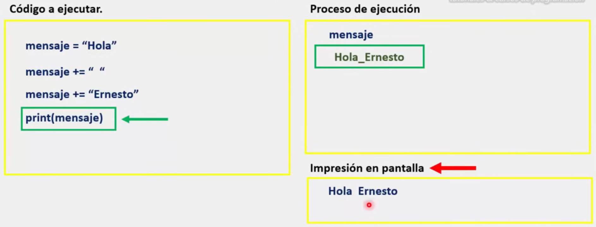
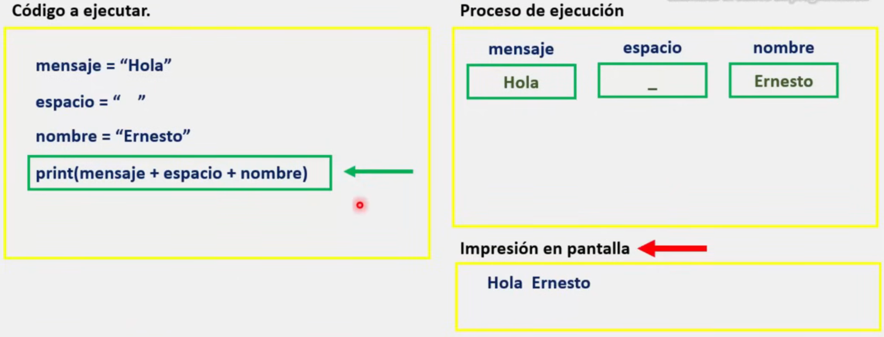
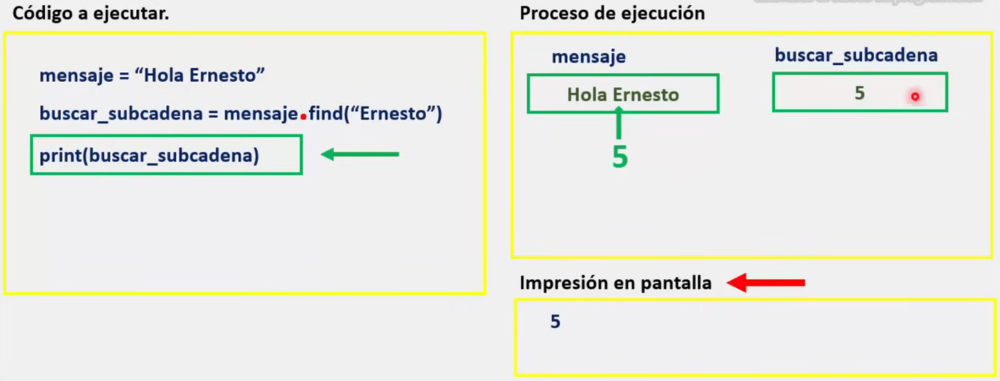
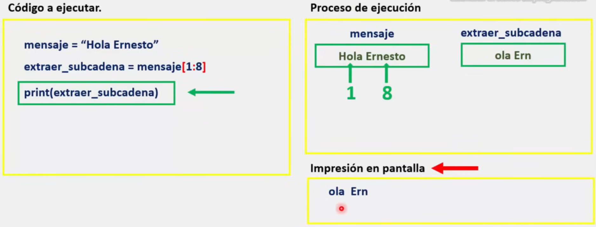
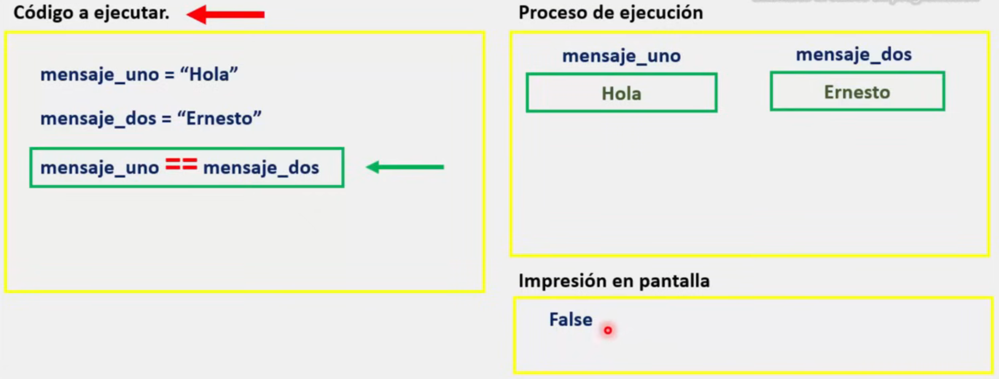

## Cadenas de caracteres

En programación, las cadenas de caracteres o mejor conocidas como Strings es una serie de caracteres compuestas por letras, números, signos y símbolos que dentro de sus funciones, destaca la interacción de un programa con el usuario.

En Python, existen distintas operaciones para manipular una cadena de caracteres (Strings). Dentro de las cuales se encuentran:

* La asignación
* La concatenación
* La Búsqueda
* La extracción
* La comparación

### Asignación

La asignación, consiste en asignar una cadena de caracteres a otra.

 Para lo cual es necesario utilizar el operador +=

Proceso grafico del proceso:
_**Aquí se sigue el orden del código a ejecutar. Mostrando tanto las impresiones en pantalla como el proceso de ejecución que existe por detrás

Posteriormente se recomienda realizar este mismo ejercicio en su computadora.

***Lo anterior para todos los procesos gráficos***

### Concatenación

La concatenación, es una operación que consiste en unir dos cadenas o más, para formar una cadena de mayor tamaño.

Para lo cual es necesario utilizar el operador +

### Búsqueda

La búsqueda consiste en localizar dentro de una cadena, una subcadena más pequeña a un carácter.

Para lo cual es necesario el método **find**.

***Método: Fragmento de código por parte del lenguaje de programación que podemos implementar.***

### La extracción

La extracción se trata de sacar fuera de una cadena una porción de la misma según su posición dentro de ella.

Para ello es necesario indicar la ***posición a extraer [1:8]***

### La comparación

La comparación se utiliza para comparar dos cadenas de caracteres.

Para ello se utiliza el operador ==

**Cuando es verdadero:**

**Cuando es falso:**

