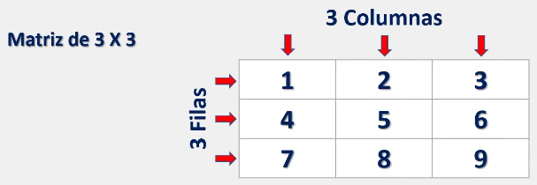
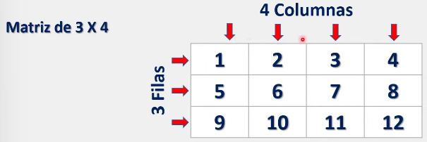
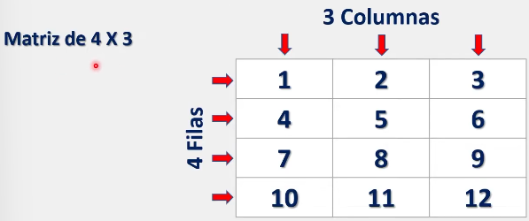
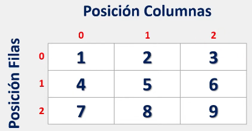
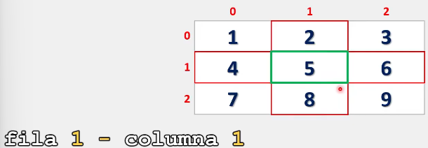
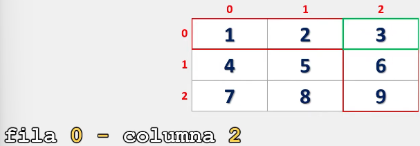
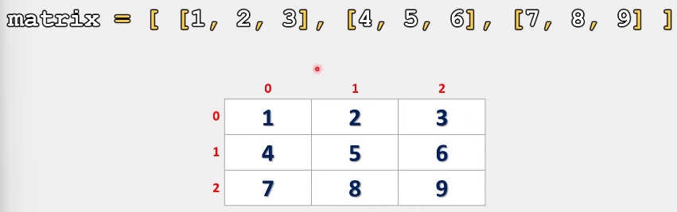
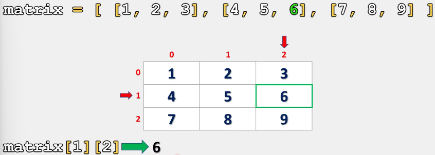

# Matrices en Python

Las matrices son una estructura de datos bidimensional cuyos elementos son organizados en filas y columnas.

Decimos que es bidimensional porque una matriz esta estructurada en dos dimensiones, es decir, un ancho que corresponde a sus filas y un largo que corresponde a sus columnas.

En Python una manera común de crear matrices es utilizando listas anidadas, con lo cual, podemos generar una colección ordenada de datos en filas y columnas:

```python:
lista_anidada = [[1, 2, 3], [4, 5, 6], [7, 8, 9]]
```

Una matriz puede contener 'm' cantidad de filas y 'n' cantidad de columnas, teniendo en cuenta que 'm' y 'n' es un número entero positivo cualquiera. Es decir, una matriz puede tener cualquier cantidad de filas y cualquier cantidad de columnas.

## Representación Grafica de una matriz.

Veamos la representación de una matriz de 3x3:



Cuando hablamos de matrices, siempre empezamos definiendo las filas y posteriormente las columnas.

\>>Por ejemplo, si decimos que tenemos una matriz de 3x4, entonces podríamos tener:



\>> Caso similar para una matriz de 4x3:



Por esto, es importante siempre empezar definiendo las filas y posteriormente las columnas.

## Accediendo a los elementos de una matriz.

Al igual que como lo veíamos con las listas, las matrices también tienen posiciones:



Por ejemplo, imaginemos que queremos mostrar el número 5.

Para ello lo primero que tendríamos que hacer seria localizar el número 5 en nuestra matriz. Posteriormente, indicaríamos la fila donde se ubica y, al final, la columna:



Al indicar la **fila 1** y **columna 1**, estamos creando una intersección donde se encuentra dicho elemento.

\>> Ahora probemos con el número tres: Para ello, tendríamos que seleccionar la **fila 0** y la **columna 2**:



## Creando matrices con Python

Como ejemplo, crearemos la matriz de la sección anterior.

```python
matriz = [[1, 2, 3], [4, 5, 6], [7, 8, 9]]

# Como se observa, el nombre hace referencia al tipo de arreglo con el que estamos trabajando y, la disposición de los elementos en esta lista es, en esencia, la matriz con la que venimos trabajando.
```



Para comprender la razón de este acomodo en el código debemos hacer notar que:

\>> El primer elemento de la lista 'matriz' (con **posición 0**) es una lista que contiene los elementos: **1, 2, 3**
\>> El segundo elemento de la lista 'matriz' (con **posición 1**) es una lista que contiene los elementos: **4, 5, 6**
\>> El tercer elemento de la lista 'matriz' con (**posición 2**) es una lista que contiene los elementos: **7, 8, 9**

Y, a su vez, cada elemento dentro de las listas anidadas tiene su propia posición.
Ejemplo:

\>> La lista anidada en la posición 0 contiene los siguientes elementos en su interior: **1, 2, 3**. Donde:
	\>> El número **1** tiene la **posición 0**
	\>> El número **2** tiene la **posición 1**
	\>> El número **3** tiene la **posición 2**.

Por lo tanto podemos concluir que: 

\>> La posición de las listas anidadas dentro de la lista 'matriz' hacen referencia a las filas.
\>> Las posiciones de los elementos en dichas listas anidadas hacen referencia a las columnas.

### Accediendo a una matriz de Python.

Para acceder a una matriz creada en Python seguiremos el mismo procedimiento visto en la nota anterior: [Listas anidadas](Primera%20parte/Listas%20anidadas.md).

Donde primero debemos especificar el nombre de la lista en la que trabajaremos, posteriormente indicaremos la posición de la lista anidada y finalmente la posición del elemento.

```python
# Ejemplo 1: Imprima el número 6 contenido en la siguiente matriz.

matriz = [[1, 2, 3], [4, 5, 6], [7, 8, 9]]

print(matriz[1][2])    # Salida: 6
```

Representación grafica:



Como se observa, acceder a los elementos de una matriz creada por Python es sencillo. Solo es necesario conocer la fila y columna en donde se encuentra nuestro elemento.

___

Un pequeño consejo y, que también es un estándar dentro de la programación, es escribir las matrices en varias líneas dentro del código para una fácil lectura:

```python
# Representación de una matriz en una sola línea:
matriz = [[1, 2, 3], [4, 5, 6], [7, 8, 9]]

# Representación de una matriz en varias líneas:
matriz = [[1, 2, 3], # Después de cada coma yo puedo insertar un salto de línea
		  [4, 5, 6], # para mejorar la legibilidad en mi código.
		  [7, 8, 9]]

# Ambos ejemplos son identicos funcionalmente. Lo estetico es lo unico que cambia.
```

Finalmente:

 > Se recomienda practicar este tema modificando los parámetros y valores de los ejercicios anteriormente presentados para comprender su funcionamiento. 