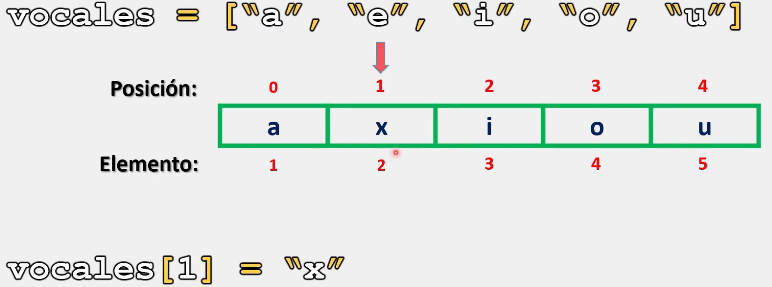
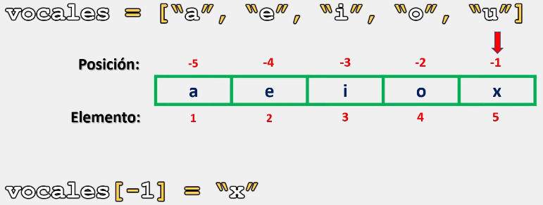
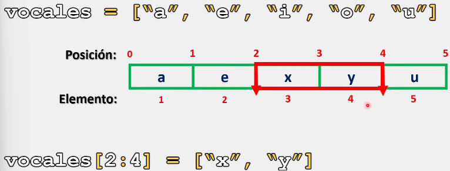
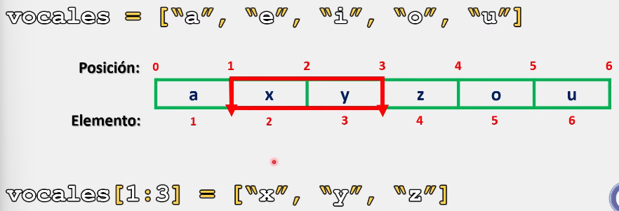
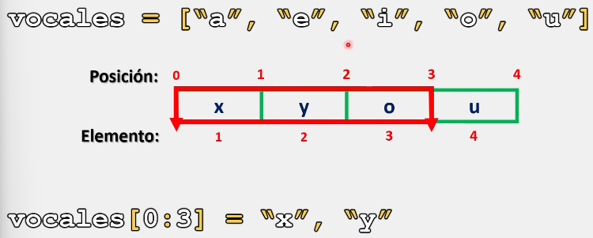

# Listas

En Python, una de las grandes ventajas al trabajar con listas es que podemos modificar cada uno de sus elementos de acuerdo a nuestras necesidades.

Modificar los elementos de una lista es muy sencillo, ya que la sintaxis que se utiliza es similar a la sintaxis que utilizamos para acceder a los elementos de una lista.

## Sintaxis.

La sintaxis para modificar los elementos de una lista es la siguiente:

```Python
# Ejemplo 1:

vocales = ["a", "e", "i", "o", "u"]
print(f"Lista original: {vocales}")
vocales[1] = "x"
print(f"Lista despúes de modificar un elemento: {vocales}")

# Salida:

# Lista original: ['a', 'e', 'i', 'o', 'u']
# Lista despúes de modificar un elemento: ['a', 'x', 'i', 'o', 'u']
```

Representación grafica:



Al momento de modificar una lista es posible agregar elementos de otros tipos de dato. Por ejemplo:

```Python
# Ejemplo 2:

vocales = ["a", "e", "i", "o", "u"]
print(f"Lista original: {vocales}")
vocales[1] = 2
print(f"Lista despúes de modificar un elemento: {vocales}")

# Salida:

# Lista original: ['a', 'e', 'i', 'o', 'u']
# Lista despúes de modificar un elemento: ['a', 2, 'i', 'o', 'u']
```

E igualmente podemos trabajar con índices negativos:

```Python
# Ejemplo 3:

vocales = ["a", "e", "i", "o", "u"]
print(f"Lista original: {vocales}")
vocales[-1] = "x"
print(f"Lista despúes de modificar un elemento: {vocales}")

# Salida:

# Lista original: ['a', 'e', 'i', 'o', 'u']
# Lista despúes de modificar un elemento: ['a', 'e', 'i', 'o', 'x']
```



### Modificando más de dos elementos:

```Python
# Ejemplo 1:

vocales = ["a", "e", "i", "o", "u"]
print(f"Lista original: {vocales}")
vocales[2:4] = ["x", "y"]  # Se pueden o no usar los corchetes. Sin embargo, por buenas practicas, es recomendado.
print(f"Lista despúes de modificar un elemento: {vocales}")

# Salida:

# Lista original: ['a', 'e', 'i', 'o', 'u']
# Lista despúes de modificar un elemento: ['a', 'e', 'x', 'y', 'u']
```

Representación grafica:



___

Cuando trabajamos con una cantidad mayor de elementos que el rango dado, Python agrega todos los elementos modificando la extensión original de la cadena:

```Python
# Ejemplo 2:

vocales = ["a", "e", "i", "o", "u"]
print(f"Lista original: {vocales}")
vocales[1:3] = ["x", "y", "z"]  # Se pueden o no usar los corchetes. Sin embargo, por buenas practicas, es recomendado.
print(f"Lista despúes de modificar un elemento: {vocales}")

# Salida:

# Lista original: ['a', 'e', 'i', 'o', 'u']
# Lista despúes de modificar un elemento: ['a', x', 'y', 'z', 'o', 'u']
```

Representación grafica:



___

En cambio, cuando declaramos menos elementos que el rango que estamos tomando, Python elimina el o los elementos 'sobrantes' del rango declarado. Ejemplo:

```Python
# Ejemplo 3:

vocales = ["a", "e", "i", "o", "u"]
print(f"Lista original: {vocales}")
vocales[0:3] = "x", "y"  # Se pueden o no usar los corchetes. Sin embargo, por buenas practicas, es recomendado.
print(f"Lista despúes de modificar un elemento: {vocales}")

# Salida:

# Lista original: ['a', 'e', 'i', 'o', 'u']
# Lista despúes de modificar un elemento: ['x', 'y', 'o', 'u']
# Donde se modifican los elementos 'a' por la 'x' y la 'e' por la 'y' para posteriormente eliminar la letra i por quedar dentro del rango especificado.
```

Representación grafica:



Ejemplo 4:

```Python
# Ejemplo 4:

vocales = ["a", "e", "i", "o", "u"]
print(f"Lista original: {vocales}")
vocales[:] = "x" # Se pueden o no usar los corchetes. Sin embargo, por buenas practicas, es recomendado.
print(f"Lista despúes de modificar un elemento: {vocales}")

# Salida:

# Lista original: ['a', 'e', 'i', 'o', 'u']
# Lista despúes de modificar un elemento: ['x']
# Donde se modifica primero la letra 'a' por la letra 'x' para despúes eliminar el resto de elementos dentro del rango especificado.
```

> Se recomienda practicar este tema modificando los parámetros y valores de los ejercicios anteriormente presentados para comprender su funcionamiento. 