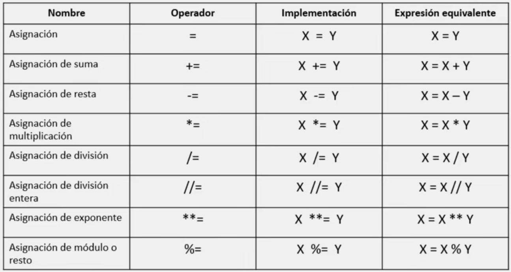

# Operadores de asignación

Un operador de asignación, como su nombre lo indica, se encarga de asignar un valor a una variable de la izquierda basado en el valor de la derecha.

El operador de asignación más utilizado es el igual (=), el cual asigna el valor que se encuentra de lado derecho a la variable de lado izquierdo.

> Es decir, x = y asigna el valor de y a x

En Python contamos con los siguientes operadores de asignación:

## Asignación (=)

El operador de asignación se implementa con ayuda del signo 'igual a' (=), es el más simple de todos y asigna a la variable de lado izquierdo cualquier variable o valor del lado derecho.

```python
# Ejemplo:

x = 5   # Con esto asignamos a la variable x el valor de 5
```

## Asignación de Suma (+=)

El operador de asignación de suma o adición se implementa con la combinación de los signos '+=', asigna en forma de suma a la variable de lado izquierdo el valor de lado derecho.

```python
# Ejemplo:

x = 3   # Se asigna un valor númerico a x
x += 5  # Se realiza la suma del valor previo más el nuevo. En este caso, 5+3 = 8

# Por lo tanto, el nuevo valor de x será 8

#_________________________________________________

# Ejemplo 2:

x = "Hola"   # Se asigna un valor str a X
x += " Alumno"  

# El operador realiza la concatenación de ambos str. "Hola" + " Alumno" = "Hola Alumno"

# Por lo tanto, el nuevo valor de x será "Hola Alumno"
```

## Asignación de Resta (-=)

El operador de asignación de resta se implementa con la combinación de los signos '-=', asigna en forma de resta a la variable de lado izquierdo, el valor de lado derecho.

```python
# Ejemplo:

x = 8   # Se asigna un valor númerico a x
x -= 5  # Se realiza la resta del valor previo menos el nuevo. En este caso, 8-5 = 3

# Por lo tanto, el nuevo valor de x será 3
```

## Asignación de Multiplicación (\*=)

El operador de asignación de multiplicación se implementa con la combinación de los signos '\*=', asigna en forma de multiplicación a la variable de lado izquierdo, el valor de lado derecho.

```python
# Ejemplo:

x = 3   # Se asigna un valor númerico a x
x *= 5  # Se realiza la multiplicación del valor previo por el nuevo. En este caso, 3*5 = 15

# Por lo tanto, el nuevo valor de x será 15
```

## Asignación de División (/=)

El operador de asignación de división se implementa con la combinación de los signos '/=', asigna en forma de división a la variable de lado izquierdo, el valor del lado derecho.

```python
# Ejemplo:

x = 10   # Se asigna un valor númerico a x
x /= 3  # Se realiza la división del valor previo con el nuevo. En este caso, 10/3 = 3.333

# Por lo tanto, el nuevo valor de x será 3.33
```

## Asignación de División Entera (//=)

El operador de asignación de división entera se implementa con la combinación de los signos '//=', calcula y asigna la división entera a la variable de lado izquierdo, el valor de lado derecho.

```python
# Ejemplo:

x = 10   # Se asigna un valor númerico a x
x //= 3  # Se realiza la división entera del valor previo con el nuevo. En este caso, 10//3 = 3

# Por lo tanto, el nuevo valor de x será 3
```

## Asignación de Exponente (\*\*=)

El operador de asignación de exponente se implementa con la combinación de los signos '\*\*=', calcula y asigna el exponente a la variable de lado izquierdo el valor de lado derecho

```python
# Ejemplo:

x = 2   # Se asigna un valor númerico a x
x **= 5  # Se realiza el exponente del valor previo con el nuevo. En este caso, 2**5 = 32

# Por lo tanto, el nuevo valor de x será 32
```

## Asignación de Módulo o Resto (%=)

El operador de asignación de módulo o resto se implementa con la combinación de los signos '%=', devuelve y asigna el resto o módulo de la división a la variable de lado izquierdo con el valor de lado derecho.

```python
# Ejemplo:

x = 10   # Se asigna un valor númerico a x
x %= 2  # Se realiza obtiene el modulo del valor previo con el nuevo. En este caso, 10 % 2 = 0

# Por lo tanto, el nuevo valor de x será 0
```

___
## Resumen de lo aprendido en esta nota:


