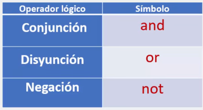
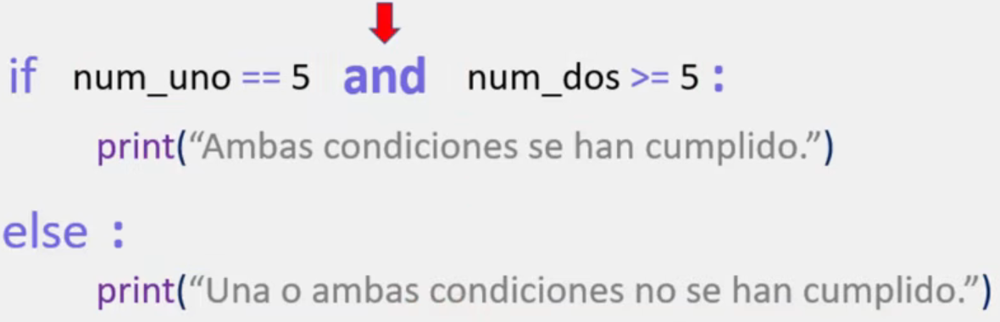
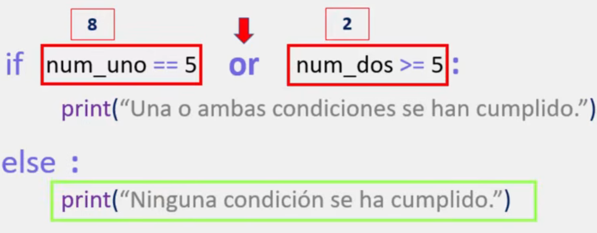
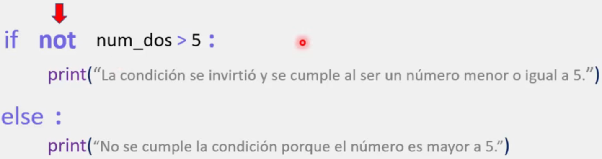

# Operadores lógicos en Python

En ocasiones, es necesario utilizar más de dos condiciones lógicas dentro de una misma condición, con lo cual, nos vemos en la necesidad de implementar múltiples operadores relacionales para crear una expresión lógica mucho más compleja.

Sin embargo, no es posible colocar dos condiciones lógicas dentro de una misma condición, sin el apoyo de algún elemento que les indique a nuestros programas, que se realizará la unión de dos o más condiciones lógicas dentro de una misma expresión.

Para este tipo de situaciones existen los operadores lógicos, los cuales permiten agrupar condiciones lógicas dentro de una misma condición. Es decir, con los operadores lógicos tenemos la posibilidad de utilizar múltiples operadores relacionales dentro de una misma condición lógica.

> En Python, contamos con tres tipos de operadores lógicos



## Ejemplo con el operador and



## Ejemplo con el operador or



## Ejemplo con el operador not



> Para consolidar el conocimiento se recomienda construir el siguiente programa:

```python
# Para la conjución (and):
#	Escribe un programa que valide si un número es mayor a 2 y menor que 5.

# Para la disyunción (or):
# Escribe un programa que valide solo cuando el usuario ingrese "yes" o "no".

# Para la negación (not):

# Escribe un programa que valide cuando el numero sea igual a 5. Es IMPORTANTE UTILIZAR el not.
```
