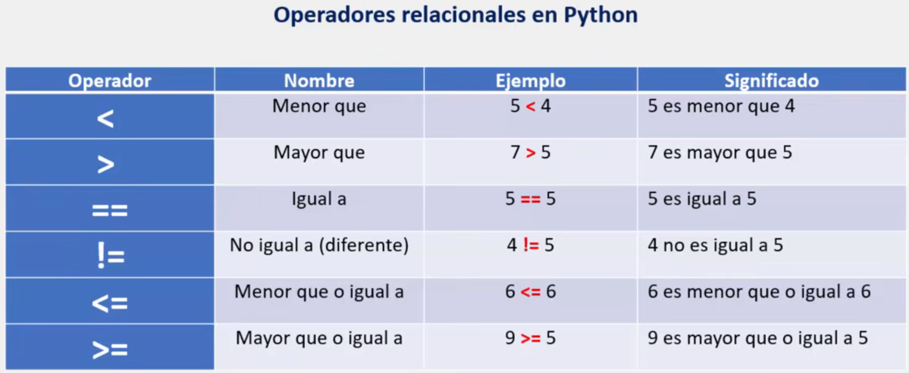

# Operadores relacionales en Python

En Python, los operadores relacionales son símbolos que se usan para comparar dos valores y generalmente son utilizados en las sentencias condicionales para la toma de decisiones.

Al utilizar operadores relacionales dentro de una sentencia condicional, si el resultado de la comparación es correcto, la expresión o condición es considerada verdadera (True), y en caso contrario será falsa (False).



En esta tabla se observan los operadores que maneja Python. Recordemos que, como se dijo anteriormente, el resultado de la comparación determina si una condición es verdadera o falsa.

Por ejemplo:

```python
# ¿5 es mayor que 3?
print(5>3)       # Salida: True

# ¿10 es mayor que 15?
print(10>15)     # Salida: False
```

>Para comprender mejor este tema se recomienda crear el siguiente programa:

```python
# Crear un comparador de números donde:

#	1. El usuario deba ingresar dos numeros:
#	   * Ingresa el primer número:
#	   * Ingresa el segundo número:
#	2. El programa debera mostrar en pantalla los dos número a comparar.
#	3. El programa debera comparar ambos numeros y mostar todos los operadores relacionales correspondientes

####################################################

# Ejemplo:

# Primer número: 15
# Segundo número: 2

# Salida:

#	Los números a comparar son: 15 y 2

#	Es diferente...
#	Es mayor...
#	Es mayor o igual...

```

