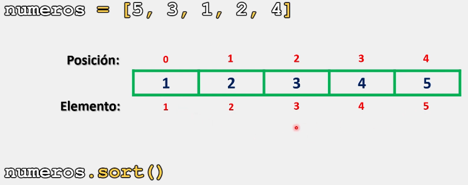
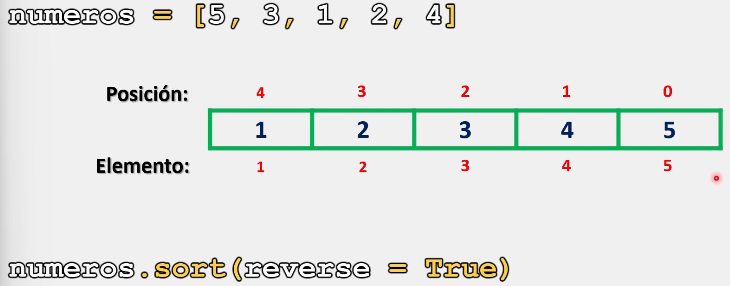

# Listas

Al trabajar con listas, cuando se ingresan los elementos que formaran parte de la misma, no siempre son ingresados de manera ordenada, con lo cual, nuestras listas pueden carecer de un orden en la información que contienen.

Para esta situación contamos con el método **sort()**, el cual nos permite ordenar una lista, tanto en orden ascendente o descendente, dependiendo de nuestras necesidades. 

El método **sort()** nos permite trabajar con un argumento para indicar que la lista será ordenada de manera descendente, es decir, de mayor a menor.

O bien, es posible no establecer ningún argumento al método **sort()**, con lo cual la lista será ordenada de manera ascendente, es decir, de menor a mayor.

## Sintaxis

La sintaxis para utilizar el método **sort()** es la siguiente:

 ```python
 nombre_lista.sort() # Para ordenar de manera ascendente (menor a mayor)
 
 nombre_lista.sort(reverse = True) # Para ordenar de manera descendente (mayor a menor)
 ```

Ahora que ya conocemos la sintaxis para poder utilizar método **sort()**, veamos cual es su implementación y comportamiento con algunos ejemplos:

```python
# Ejemplo 1:

numeros = [5, 3, 1, 2, 4]

print(f"Lista antes del método: {numeros}")

numeros.sort()

print(f"Lista después del método: {numeros}")

numeros.sort(reverse = True)

print(f"Lista después del método con reverse: {numeros}")

# Salida:

# Lista antes del método: [5, 3, 1, 2, 4]
# Lista después del método: [1, 2, 3, 4, 5]
# Lista después del método con reverse: [5, 4, 3, 2, 1]
```

Como se observa, en el primer **sort()**, la lista se ordena de manera ascendente (menor a mayor):



Y, en el segundo **sort()** con el parámetro ** reverse = True ** dentro de los paréntesis, la lista se devuelve de manera descendente:



Este método igualmente puede trabajar con strings:

```python
# Ejemplo 2:

vocales = ["o", "u", "a", "i", "e"]

print(f"Lista antes del método: {vocales}")

vocales.sort()

print(f"Lista después del método: {vocales}")

vocales.sort(reverse = True)

print(f"Lista después del método con reverse: {vocales}")

# Salida:

# Lista antes del método: ['o', 'u', 'a', 'i', 'e']
# Lista después del método: ['a', 'e', 'i', 'o', 'u']
# Lista después del método con reverse: ['u', 'o', 'i', 'e', 'a']
```

Finalmente es importante mencionar que este método solo puede trabajar con listas homogéneas (flotantes y enteros, al ser números, pueden trabajar juntos).

Es decir si nuestra lista contiene datos numéricos (**float** e **int**) junto con **str**, **bool** y/o **complex**, el método no funcionará.

> Se recomienda practicar este tema modificando los parámetros y valores de los ejercicios anteriormente presentados para comprender su funcionamiento. 
