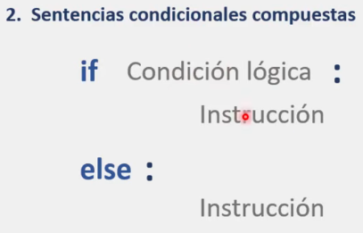
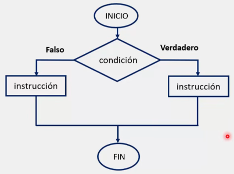
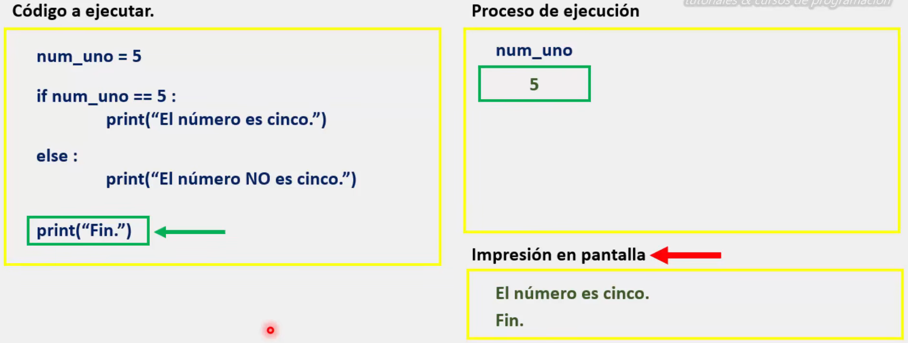
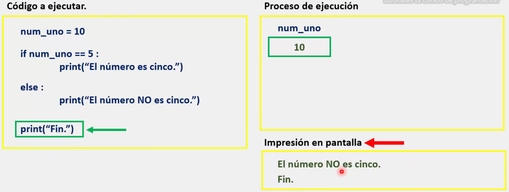

# Sentencias condicionales compuestas en Python (if - esle)

En Python, las sentencias condicionales compuestas son aquellas que nos permiten tener una instrucción  a ejecutar de acuerdo a la condición establecida.

Es decir, si la condición se cumple, habrá una instrucción a ejecutar correspondiente a la rama de verdadero.
Pero, de igual manera, si la condición "NO" se cumple, habrá otra instrucción a ejecutar correspondiente a la rama de falso.

En las sentencias condicionales compuestas, jamás se ejecutarán de manera simultanea las instrucciones de ambas ramas, únicamente, se ejecutará la instrucción correspondiente a la rama de verdadero o falso, cuya decisión es determinada por la condición establecida.

## Sintaxis



Donde: 
* ***'if' y 'else':*** son las palabras reservadas necesarias para ejecutar estos bloques de código.
* ***'Condición lógica'***: Es quien va a regir el comportamiento general de nuestra sentencia condicional.
* ***' : '***: Son los dos puntos que le indican a Python que se "prepare" para leer las instrucciones.
* ***'Instrucción'***: Son las instrucciones que queremos que nuestro programa ejecute. 

Es importante volver a mencionar que, como se escribió anteriormente: **Jamás se ejecutarán de manera simultanea las instrucciones de ambas ramas, únicamente, se ejecutará la instrucción correspondiente a la rama de verdadero o falso, cuya decisión es determinada por la condición establecida.**

### Diagrama de flujo para una sentencia condicional compuesta.



### Proceso de ejecución de una sentencia condicional compuesta:



Cuando la sentencia lógica es verdadera, las instrucciones contenidas en 'if' se ejecutan.



En cambio, cuando la sentencia es falsa, nuestro programa toma el camino de falso y ejecuta las instrucciones contenidas en 'else'.

 >Por último, se recomienda retomar el programa de la sesión anterior, modificando unas pocas instrucciones, para practicar y comprender el tema:

 ```python
# Crea un programa llamado "Sistema para calcular el promedio de un alumno".
 
# Sistema donde el usuario debera ingresar mediante la función 'input()' los siguientes datos:
#	* Nombre
#	* Calificación en matemáticas
#	* Calificación en quimica
#	* Calificación en biología

# Al finalizar, el programa debera mostrar en pantalla el siguiente mensaje:

# Si el promedio es mayor o igual a 6.6 (promedio >= 6.6):

'Felicidades {nombre de usuario}, "aprobaste" con un promedio de: {promedio de las tres calificaciones}'
'Fin.'

# Si la condición no se cumple:
'Lo sentimos {nombre de usuario}, has "reprobado" con un promedio de: {promedio de las tres calificaciones}'
'Fin.'

 ```

## round() 

En este punto se recomienda introducir el uso de la herramienta ***round()*** para controlar la cantidad de decimales.

A continuación se comparten una pequeña explicación de esta herramienta y algunos ejemplos de su uso:

>La función **`round()`** en Python es una herramienta nativa utilizada para redondear números de punto flotante a una precisión específica o al entero más cercano.  Su sintaxis básica es **`round(number, ndigits)`**, donde `number` es el valor a redondear y `ndigits` es un parámetro opcional que indica la cantidad de decimales deseados; si se omite, el valor predeterminado es **0**. 

**Características clave y comportamiento:**

*  **Redondeo medio a par:** En Python 3, `round()` utiliza la estrategia "round half to even" (redondeo medio a par) para minimizar el sesgo estadístico. Esto significa que cuando un número termina exactamente en .5, se redondea al entero par más cercano (ejemplo: `round(2.5)` devuelve **2** y `round(3.5)` devuelve **4**). 

* **Retorno de tipo:** Si no se especifica `ndigits`, la función devuelve un **entero**.  Si se especifica `ndigits` (incluso si es 0 o negativo), devuelve un **número flotante**. 

* **Precisión y módulos alternativos:** Para cálculos financieros o donde se requiere precisión decimal exacta sin los errores de punto flotante, se recomienda usar el módulo **`decimal`** con el método `.quantize()`, ya que permite controlar explícitamente la estrategia de redondeo (ej.  `ROUND_HALF_UP`).

**Ejemplos de uso:**

``` python
# Redondeo al entero más cercano (usa redondeo medio a par)
print(round(3.6))   # Salida: 4
print(round(2.5))   # Salida: 2 (redondea al par más cercano)

# Redondeo a un número específico de decimales
print(round(3.14159, 2))  # Salida: 3.14

# Redondeo negativo (decenas, centenas, etc.)
print(round(12345, -2))   # Salida: 12300
```

## ¿Comillas dobles o comillas simples? en input()

Finalmente, aunque no menos importante, se recomienda mostrar el uso de comillas dobles y comillas simples en la función ***Input()***:

>En Python, el uso de comillas simples (`' '`) o dobles (`" "`) en la función `input()` es **funcionalmente idéntico**; ambas definen la cadena de texto del mensaje que se muestra al usuario. 

* **Intercambiabilidad**: Se puede usar cualquiera de las dos para delimitar el mensaje, siempre que la comilla de apertura coincida con la de cierre.

* **Gestión de comillas internas**: Si el mensaje contiene comillas simples, es recomendable usar comillas dobles para delimitar el `input` (y viceversa) para evitar errores de sintaxis o el uso de caracteres de escape.

``` python
# Ejemplo con comillas dobles externas para evitar escapar el apóstrofe

	nombre = input("¿Cuál es tu nombre? ")

 # Ejemplo con comillas simples externas para evitar escapar las dobles

    mensaje = input('Dijo: "Hola"') 
```

* **Consistencia**: La elección no afecta la lógica del programa, por lo que la recomendación general es mantener un estilo consistente en todo el proyecto.
