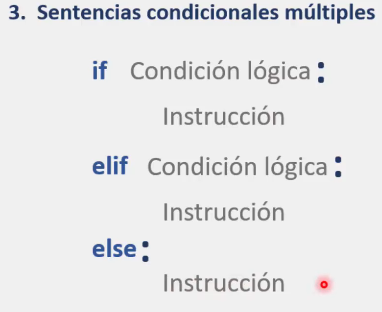
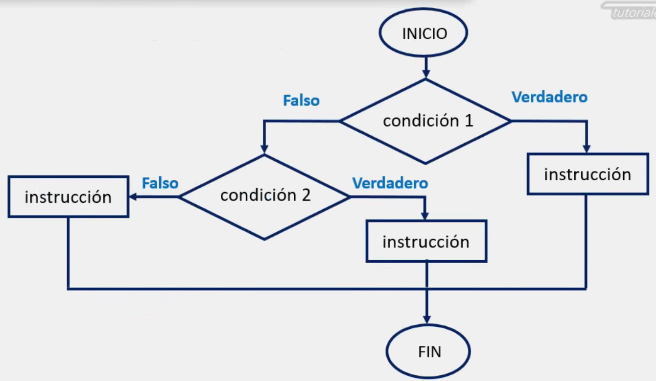
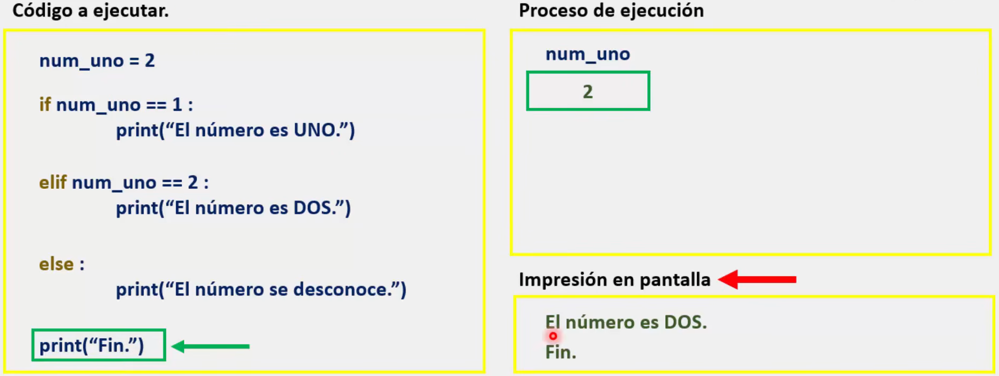

# Sentencias condicionales múltiples en Python (elif)

En Python, al utilizar las sentencias condicionales simples y compuestas, nos podemos encontrar con la necesidad de integrar más de una condición a una misma estructura condicional.

Para ello, contamos con las sentencias condicionales múltiples, las cuales tienen como finalidad, la toma de decisiones especializadas que permiten evaluar una variable con distintos resultados, ejecutando para cada caso una seria de instrucciones especificas.

La sentencia condicional múltiple nos permite elegir una ruta de entre varias rutas posibles con base al valor de una variable que actúa como selector.

En el momento en que alguna de las condiciones se cumpla, se ejecuta la instrucción o instrucciones correspondientes a dicha condición y la ejecución de la sentencia condicional finalizara.

## Sintaxis



Donde: 
* ***'if', 'elif' y 'else':*** son las palabras reservadas necesarias para cada uno de estos bloques de código.
* ***'Condición lógica'***: Son quienes van a regir el comportamiento general de nuestra sentencia condicional para cada bloque.
* ***' : '***: Son los dos puntos que le indican a Python que se "prepare" para leer las instrucciones.
* ***'Instrucción'***: Son las instrucciones que queremos que nuestro programa ejecute. 

Es importante volver a mencionar que, como se escribió anteriormente: **La sentencia condicional múltiple nos permite elegir una ruta de entre varias rutas posibles con base al valor de una variable que actúa como selector.**

**En el momento en que alguna de las condiciones se cumpla, se ejecuta la instrucción o instrucciones correspondientes a dicha condición y la ejecución de la sentencia condicional finalizara.**
### ### Diagrama de flujo para una sentencia condicional múltiple.



Algo que también cabe destacar es que, una sentencia condicional múltiple, no necesariamente debe contener solo dos condiciones. Es decir, puede contener mas de un 'elif'.
### Proceso de ejecución de una sentencia condicional múltiple:




El funcionamiento es exactamente al que ya hemos tratado en notas anteriores, por lo que solo se adjunta una captura de pantalla de cuando la segunda condición lógica es verdadera.

>Por último, se recomienda crear el siguiente programa para practicar y comprender el tema:

```python
# Crear un programa llamado:
'''
=================================
¡Convertidor de números a letras!
=================================
'''

# El programa deberá realizar lo siguiente:

#	1. Solicitar un número para convertir.
#	2. Si el número es >= 1 y <=5; imprimir en pantalla:

#		El número es: {numero ingresado en letras}

#	Si el número es > 5, imprimir:

#		Este programa solo puede convertir hasta el número 5.

#	3. Sin importar el número, el programa, al finalizar, siempre debera mostrar el mensaje:

#		Fin.

```

