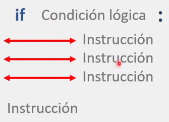
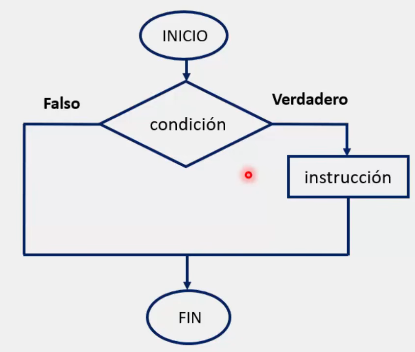
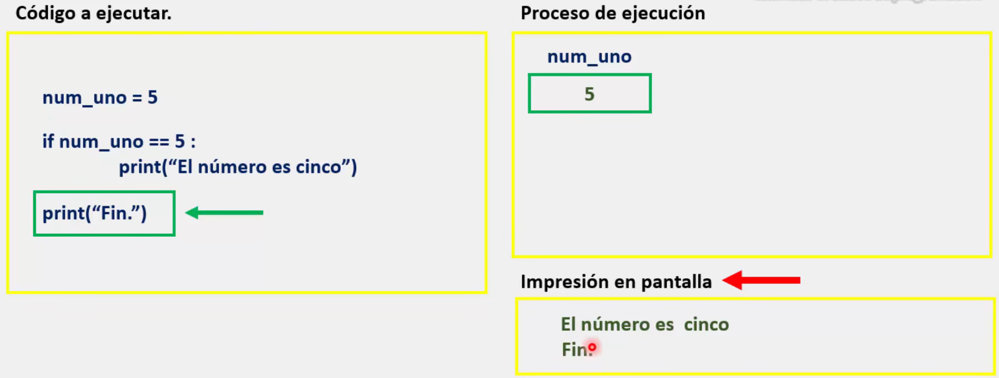
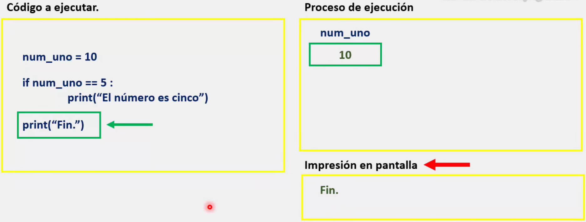

Una **sentencia condicional**, es una **instrucción** o grupo de instrucciones que se ejecutan cuando a un programa se le establece una condición lógica. Al cumplirse dicha condición, el programa ejecuta la instrucción que a sido asignada a esta condición.

Las sentencias condicionales nos ayudan a controlar la toma de decisiones dentro de un programa, haciendo uso de la lógica.

De esta manera, las sentencias condicionales comprueban si una condición es verdadera o falsa y con base a eso se lleva a cabo una acción.

La sintaxis para las sentencias condicionales son las siguientes:

## 1. Sentencias condicionales simples

La sintaxis luce de la siguiente manera:



Donde:
* ***'if'*** es la palabra reservada necesaria para utilizar una sentencia condicional. Esta siempre se coloca al inicio.
* ***'Condición lógica'*** es quien va a regir el comportamiento general de nuestra sentencia condicional.
* ***' : '*** Con los dos puntos nosotros estaríamos indicándole a Python que hemos concluido de colocar la condición lógica que va a regir el comportamiento de nuestra sentencia condicional. 

Con estos primeros tres puntos nuestro programa evalúa la condición escrita, existiendo dos caminos para una condición lógica: **Verdadero** o **Falso**. Es decir, que la condición se cumpla o no.

En caso de que la condición se cumpla (sea verdadera), Python ejecutara la serie de instrucciones que hayamos escrito previamente:

* ***'Instrucción'*** Son las instrucciones que queremos que nuestro programa ejecute. 

Algo importante a mencionar es que, siempre que nosotros queramos integrar alguna instrucción a ejecutar dentro de nuestra sentencia condicional, es necesario agregar una tabulación. En la imagen dicha tabulación es representada con una flecha doble de color rojo.

* ***'Indentado de código'*** es la tabulación previa a una instrucción.

La indentación puede ser de dos tipos según el lenguaje:

> **Indentación no significativa**: En lenguajes como **C**, **Java** o **C#**, la indentación es puramente estética y opcional; la estructura del código se define mediante llaves `{}`. 

> **Indentación significativa**: En lenguajes como **Python**, **Haskell** u **Occam**, la indentación es obligatoria y determina la estructura lógica del programa, definiendo qué líneas pertenecen a un bloque de código específico.

Cuando una instrucción no se encuentra "dentro" de nuestra sentencia condicional mediante el tabulado (como se observa en la imagen con la última instrucción), Python interpreta dicha instrucción como una condición "ajena" al bloque y la ejecutara al finalizar el mismo.

### Diagrama de flujo para una sentencia condicional simple.



### Proceso de ejecución con una sentencia condicional:



Cuando la sentencia lógica es verdadera, las instrucciones contenidas se ejecutan.



En cambio, cuando la sentencia es falsa, nuestro programa toma el camino de falso, ignorando las instrucciones al interior.

> Por último, se recomienda crear el siguiente programa para practicar y comprender el tema:

 ```python
# Crea un programa llamado "Sistema para calcular el promedio de un alumno".
 
# Donde el usuario debera agregar los siguientes datos:
#	* Nombre
#	* Calificación en matemáticas
#	* Calificación en quimica
#	* Calificación en biología

# Al finalizar, el programa debera mostrar en pantalla el siguiente mensaje:

# Si el promedio es mayor o igual a 6.6 (promedio >= 6.6):

'Felicidades {nombre de usuario}, "aprobaste" con un promedio de: {promedio de las tres calificaciones}'
'Fin.'

# Si la condición no se cumple:

'Fin.'

 ```

