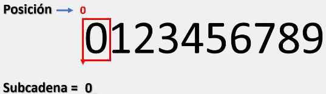
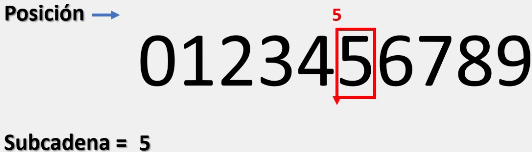
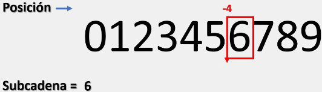
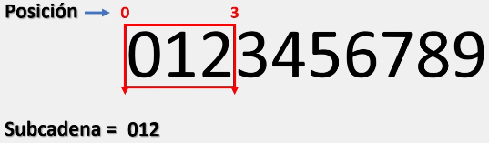
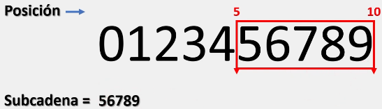
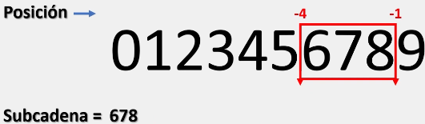
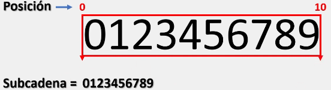
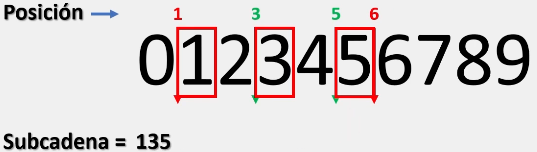

# Substrings

En Python, una cadena de caracteres es una sucesión que puede contener caracteres especiales o alfanuméricos.

Es decir, letras, números y/o símbolos.

Un ejemplo de una cadena es: **"Aprendiendo Python desde cero"** y en Python es posible acceder a partes especificas de una cadena de caracteres también llamadas substrings o subcadenas.

> Un substring o subcadena es una sucesión de caracteres dentro de una cadena principal. Por ejemplo si la cadena principal es: **"Aprendiendo Python desde cero"**, algunos substrings serian: **"Aprendiendo Python"**, **"Python desde cero"**, **"P"**

Para generar subcadenas a partir de una cadena principal es necesario utilizar la siguiente sintaxis:

```python
variable[inicio : final : saltos]
```

Donde:
* inicio: Establece al índice en donde se iniciara la subcadena.
* final: Establece al índice en donde se terminará la subcadena.
* saltos: Establece el número de saltos que realizará el índice para generar la subcadena

Los valores asignados a el **inicio, final y saltos**, deberán se valores enteros, y a su vez, el valor que se le asigne a los índices pueden ser positivos o negativos

Teniendo en cuenta que los índices positivos se situaran desde el inicio de la cadena, haciendo su recorrido de izquierda a derecha.

Mientras que los índices negativos se situaran desde el final de la cadena, haciendo su recorrido igualmente de izquierda a derecha.

Para comprender mejor este tema, veamos algunos ejemplos:

## Trabajando con un valor dentro de los corchetes.

```python
# Ejemplo 1:
string = "0123456789"
print(string[0])

# Salida: 0

# Ejemplo 2:
string = "0123456789"
print(string[5])

# Salida: 5
```

Al únicamente especificar el inicio, Python se posiciona en dicha posición y nos muestra el valor que tiene a la derecha:



o:



Con los números negativos Python realiza exactamente lo mismo:

```python
string = "0123456789"
print(string[-5])

# Salida: 6
```

Primero se ubica en la posición especificada y después nos muestra el valor que tiene a la derecha:



En conclusión, cuando trabajamos con un único valor (correspondiente al inicio), siempre obtendremos una subcadena de longitud uno.

___
## Trabajando con dos valores dentro de los corchetes.

```python
string = "0123456789"
print(string[0:3])

# Salida: 012
```

Cuando trabajamos con dos valores, Python nos devuelve los valores encasillados dentro del rango especificado:



De igual forma, cuando trabajamos con dos valores, es posible no indicar el primer valor (correspondiente al inicio):

```python
string = "0123456789"
print(string[:3])

# Salida: 012
```

En dicho caso, Python interpretara que se desea buscar desde la posición cero:


En cambio, cuando no especificamos el segundo valor (correspondiente al valor final):

```python
string = "0123456789"
print(string[5:])

# Salida: 56789
```

Python interpretara que se desea buscar desde la posición de inicio indicada hasta la ultima posición disponible:



Al momento de trabajar con dos valores negativos de manera simultanea:

```python
string = "0123456789"
print(string[-4:-1])

# Salida: 678
```

Python primero se ubica en las posiciones especificadas antes de mostrar los valores dentro del rango:



Y, si trabajamos con dos valores de manera simultanea pero no especificamos ninguno (no especificamos el inicio o final):

```python
string = "0123456789"
print(string[0:0])

# Salida: 0123456789
```

Python nos devuelve el string original en su totalidad:



___
## Trabajando con tres valores dentro de los corchetes.

```python
string = "0123456789"
print(string[1:6:2])

# Salida: 135
```

Cuando trabajamos con tres valores, Python nos devuelve los valores encasillados dentro del rango especificado y respetando los saltos especificados (en este caso de 2):



Igualmente, al trabajar con tres valores dentro de los corchetes, podemos NO especificar el inicio y final, solo especificando los saltos:

```python
string = "0123456789"
print(string[0:0:3])

# Salida: 0369
```

Donde Python nos devuelve los valores encasillados en dicho rango y respetando los saltos especificados (en este caso 3):


> Para comprender mejor este tema, se recomienda realizar el siguiente ejercicio en su computadora modificando las variables y/o las líneas de código:

```python
string = "0123456789"
substring = ""

print (f"Cadena principal: {string}")

substring = string [0]
print (f"\nSubcadena con indice en la posicion [0] es: {substring}")

substring = string [5]
print (f"\nSubcadena con indice en la posicion [5] es: {substring}")

substring = string [-4]
print (f"\nSubcadena con indice en la posicion [-4] es: {substring}")

substring = string [0:3]
print (f"\nSubcadena con indices en las posiciones [0:3] es: {substring}")

substring = string [ : 3]
print (f"\nSubcadena con indices en las posiciones [:3] es: {substring}")

substring = string [5 :]
print (f"\nSubcadena con indices en las posiciones [5:] es: {substring}")

substring = string[-4 :- 1]
print (f"\nSubcadena con indices en las posiciones [-4 :- 1] es: {substring}")

substring = string [: ]
print (f"\nSubcadena con indices en las posiciones [: ] es: {substring}")

substring = string [1:6:2]
print (f"\nSubcadena con indices en las posiciones y salto [1:6:2] es: {substring}")

substring = string [ :: 3]
print (f" \nSubcadena con indices en las posiciones y salto [ :: 3] es: {substring}")

# Salida:

# Cadena principal: 0123456789
#
# Subcadena con indice en la posicion [0] es: 0
#
# Subcadena con indice en la posicion [5] es: 5
#
# Subcadena con indice en la posicion [-4] es: 6
#
# Subcadena con indices en las posiciones [0:3] es: 012
#
# Subcadena con indices en las posiciones [:3] es: 012
#
# Subcadena con indices en las posiciones [5:] es: 56789
#
# Subcadena con indices en las posiciones [-4 :- 1] es: 678
#
# Subcadena con indices en las posiciones [: ] es: 0123456789
#
# Subcadena con indices en las posiciones y salto [1:6:2] es: 135
#
# Subcadena con indices en las posiciones y salto [ :: 3] es: 0369
```