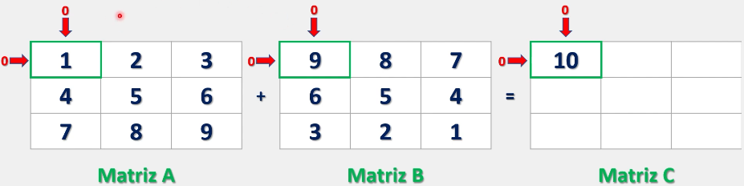
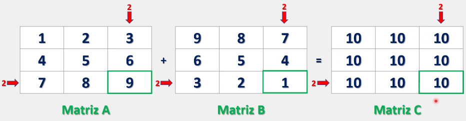
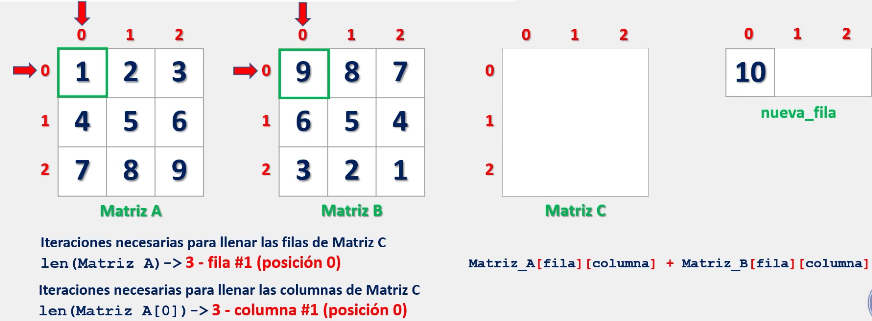
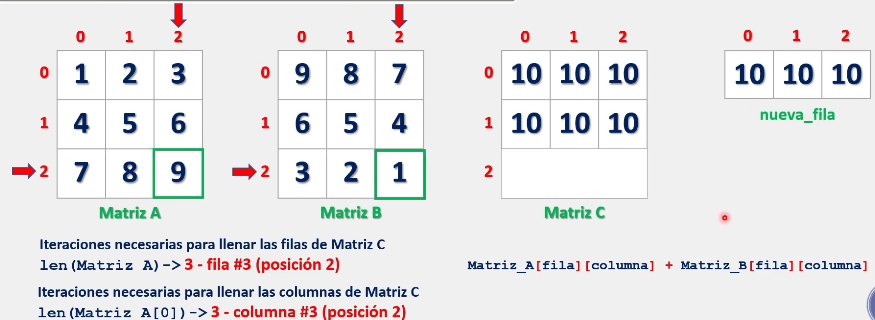

# Matrices

Cuando tenemos dos o más matrices, es posible realizar operaciones entre ellas, es decir, podemos sumarlas, restarlas, multiplicarlas e incluso dividirlas.

Sin embargo, únicamente nos centraremos en la suma de matrices, ya que la finalidad es comprender el comportamiento de las listas anidadas en Python.

## Suma de matrices

En matemáticas, a suma de matrices es una operación lineal que consiste en unificar los elementos de dos o más matrices que coincidan en posición dentro de sus respectivas matrices.

A su vez, las matrices deberán tener la misma dimensión, es decir, deben tener la misma cantidad de filas y columnas, de lo contrario, la suma no podrá efectuarse.

Ejemplo visual:

\>> Inicio:



\>> Final:



Como se observa, para sumar dos matrices, se deben sumar los elementos en las mismas posiciones de dichas matrices. Es decir, el valor del elemento con posición **0,0 de la matriz A** debe sumarse al valor del elemento con posición **0,0 de la matriz B** y, el resultado, se colocara en la posición **0,0 de la matriz C**.

Esta misma lógica se debe llevar a la programación para efectuar un correcto llenado de nuestra matriz donde, para nuestra comodidad, podemos usar herramientas ya vistas durante este curso:

```python
# Para conocer la cantidad de filas de nuestra matriz:
len(matriz) # Len() nos entrega el total de elementos de nuestra lista, es decir, las filas.

# Para conocer la cantidad de columnas de nuestra matriz:
len(matriz[posicion]) # Donde 'posicion' representa cualquier índice disponible en nuestra lista. Aquí nos aprovechamos del hecho de que las matrices deben contener la misma cantidad de columnas para cada fila.
```

Con lo anterior dicho, podemos fácilmente intuir la manera en que tendría que operar nuestro algoritmo para realizar la suma:

```python
# Para sumar los elementos podemos escribir:
Matriz_A[fila][columna] + Matriz_B[fila][columna] = Matriz_C[fila][columna]

# Donde cada fila y columna debe ser la misma para cada matriz. Logrando así una suma correcta de nuestras matrices.
```

Representación grafica:

Inicio:



Final:



Donde, como se observa, al llenarse las posiciones de la 'nueva_fila' esta es insertada en la **Matriz C**.

Finalmente, veamos la representación del algoritmo anterior en código:

```python
# Creamos nuestra matriz A

matriz_a = [[1, 2, 3],
            [4, 5, 6],
            [7, 8, 9]]

# Creamos nuestra matriz B

matriz_b = [[1, 2, 3],
            [4, 1, 2],
            [1, 1, 0]]

# Creamos nuestra matriz C

matriz_c = []

# Iteramos sobre las filas de la matriz A
for fila in range(len(matriz_a)):

    # Creamos una nueva fila para la matriz C
    new_fila = []

    # Iteramos sobre las columnas de la matriz A
    for columna in range(len(matriz_a[0])):

        # Sumamos los valores de la matriz A y la matriz B
        new_fila.append(matriz_a[fila][columna] + matriz_b[fila][columna])

    # Agregamos la nueva fila a la matriz C
    matriz_c.append(new_fila)

# Imprimimos las matrices
for fila in range(len(matriz_a)):
    # Si la fila es diferente a 1, la imprimimos sin el signo de suma
    # (solo en este caso debido a que la matriz es de 3x3)
    if fila != 1:
        print(f"{matriz_a[fila]}   {matriz_b[fila]}   {matriz_c[fila]}")

    # Si la fila es igual a 1, la imprimimos con el signo de suma
    # (solo en este caso debido a que la matriz es de 3x3)
    else:
        print(f"{matriz_a[fila]} + {matriz_b[fila]} = {matriz_c[fila]}")
        
# Salida:

# [1, 2, 3]   [1, 2, 3]   [2, 4, 6]
# [4, 5, 6] + [4, 1, 2] = [8, 6, 8]
# [7, 8, 9]   [1, 1, 0]   [8, 9, 9]
```

Finalmente:

 > Se recomienda practicar este tema modificando los parámetros y valores de los ejercicios anteriormente presentados para comprender su funcionamiento. Especialmente porque suele ser complicado al inicio comprender la forma en como trabajamos con índices dentro de una lista anidada.