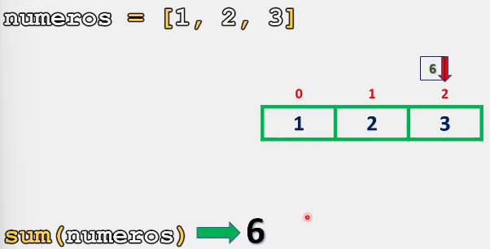
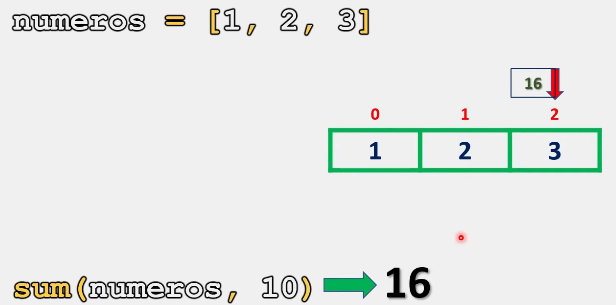
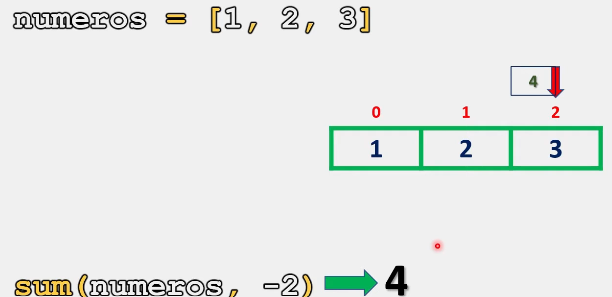
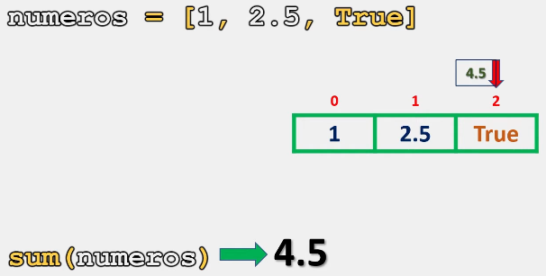
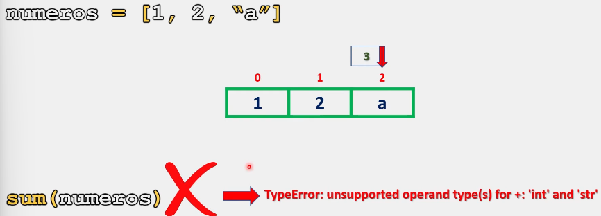

# Listas

Al trabajar con listas que contienen únicamente valores numéricos, surge la necesidad de sumar todos los elementos contenidos en la lista.

## Método sum()

Para esta situación, contamos con el método **sum()**, el cual nos regresa la suma de todos los elementos de una lista, compuesta únicamente por los valores numéricos.

### Sintaxis.

La sintaxis para utilizar el método **sum()**, es la siguiente:

```python
# Este metodo trabaja con un minimo de un argumento y un máximo de dos:

# Trabajando con un argumento:
sum(objeto_iterable)

# Trabajando con dos argumentos:
sum(objeto_iterable, valor_inicial)
```

Ahora que ya conocemos la sintaxis del método **sum()**, veamos cual es su implementación y comportamiento con algunos ejemplos:

```python
# Ejemplo 1:

numeros = [1,2,3]
print(sum(numeros))

# Salida: 6
```

Como se observa en el ejemplo anterior, este método realiza la suma de los valores contenidos dentro de la lista y nos retorna dicha suma.




Ahora, cuando utilizamos dos argumentos: **(objeto iterable, valor inicial)**. Python realiza la suma de los elementos de la lista y suma nuestro valor inicial.

```python
# Ejemplo 2:

numeros = [1,2,3]
print(sum(numeros, 10))

# Salida: 16
```

Representación grafica:



Ejemplo 3:

```python
# Ejemplo 3:

numeros = [1,2,3]
print(sum(numeros, -2))

# Salida: 4
```

Representación grafica:



___

Algo interesante que sucede con los valores boléanos es que ambos poseen un valor numérico: 1 para **True** y 0 para **False**

```python
# Ejemplo 4:

numeros = [1,2.5,True]
print(sum(numeros))

# Salida: 4.5
```

Representación grafica:



___

Ahora, cuando tenemos un elemento dentro de nuestra lista que no corresponde a tipo numérico, Python nos marcara un error:

```python
# Ejemplo 5:

numeros = [1,2,"a"]
print(sum(numeros))

# Salida: TypeError: unsupported operand type(s) for +: 'int' and 'str'
```

Representación  grafica:



Finalmente:

> Se recomienda practicar este tema modificando los parámetros y valores de los ejercicios anteriormente presentados para comprender su funcionamiento. 